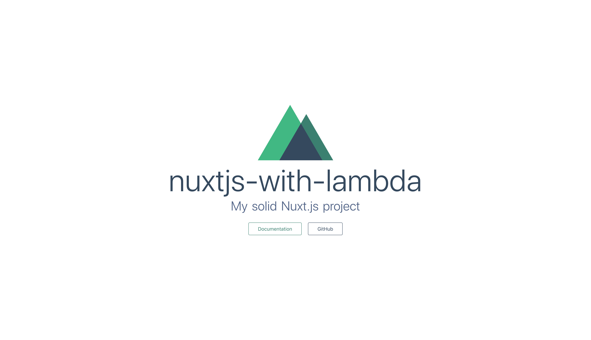

해당 예제는 [Apex Up](https://up.docs.apex.sh/)을 사용하여서 aws lambda에 배포합니다.

### 1. Nuxt.js 초기 설치

```shell
$ yarn create nuxt-app <my-project>
```

또는

```shell
$ npx create-nuxt-app <project-name>
```

npx 명령어는 npm 5.2.0 버전 이후부터 실행 가능합니다.

위 명령어로 nuxt.js를 설치시 server framework를 선택할 때
None(Nuxt default server)가 아닌 다른 것을 선택해야 lambda에 배포 가능합니다.

저는 Express를 선택하였습니다.

package manager는 yarn으로 선택합니다.
이유는 lambda에 올릴시 용량이 작아야 하는데 npm보다 yarn이 압축률이 현재는 더 좋기 때문입니다.
(람다는 250MB의 용량 제한이 있습니다.)

### 2. Apex Up 설치

```shell
$ curl -sf https://up.apex.sh/install | sh
```

위 명령어로 설치 후 아래 명령어 실행시 제대로 동작한다면 apex up 설치가 완료된 것입니다.

```shell
$ up version
```

### 3. AWS credentials 설정

up으로 올리기 위해서는 aws credentials 설정이 필요합니다. 저는 아래 링크를 참고하여서 만들었습니다.
(https://lee-seul.github.io/other/2018/05/13/AWS-Credentials.html)

저는 설정 후 `~/.aws/credentials`에 아래와 같이 설정하였습니다.

```shell
# ~/.aws/credentials

[my-aws-account-for-lambda]
aws_access_key = xxxxxxxxxxxxx
aws_secret_access_key = xxxxxxxxxxxxxxxxxxxx
```

### 4. IAM 정책 설정

AWS IAM에서 정책을 새로이 json형식으로 추가합니다.

```json
{
  "Version": "2012-10-17",
  "Statement": [
    {
      "Effect": "Allow",
      "Action": [
        "acm:*",
        "cloudformation:Create*",
        "cloudformation:Delete*",
        "cloudformation:Describe*",
        "cloudformation:ExecuteChangeSet",
        "cloudformation:Update*",
        "cloudfront:*",
        "cloudwatch:*",
        "ec2:*",
        "ecs:*",
        "events:*",
        "iam:AttachRolePolicy",
        "iam:CreatePolicy",
        "iam:CreateRole",
        "iam:DeleteRole",
        "iam:DeleteRolePolicy",
        "iam:GetRole",
        "iam:PassRole",
        "iam:PutRolePolicy",
        "lambda:AddPermission",
        "lambda:Create*",
        "lambda:Delete*",
        "lambda:Get*",
        "lambda:InvokeFunction",
        "lambda:List*",
        "lambda:RemovePermission",
        "lambda:Update*",
        "logs:Create*",
        "logs:Describe*",
        "logs:FilterLogEvents",
        "logs:Put*",
        "logs:Test*",
        "route53:*",
        "route53domains:*",
        "s3:*",
        "ssm:*",
        "sns:*"
      ],
      "Resource": "*"
    },
    {
      "Effect": "Allow",
      "Action": "apigateway:*",
      "Resource": "arn:aws:apigateway:*::/*"
    }
  ]
}
```

### 5. `up.json`파일 생성

```json
{
  "name": "nextjs-example",
  // aws account profile in ~/.aws/credentials
  "profile": "my-aws-account-for-lambda",
  "regions": ["ap-northeast-2"],
  "lambda": {
    // min 128, default 512
    "memory": 256,
    // AWS Lambda supports node.js 8.10 latest
    "runtime": "nodejs8.10"
  },
  "proxy": {
    "command": "npm start",
    "timeout": 25,
    "listen_timeout": 15,
    "shutdown_timeout": 15
  },
  "stages": {
    "development": {
      "proxy": {
        "command": "npm dev"
      }
    }
  },
  "environment": {
    // you can hydrate env variables as you want.
    "NODE_ENV": "production"
  },
  "error_pages": {
    "variables": {
      "support_email": "admin@my-email.com",
      "color": "#2986e2"
    }
  }
}
```

여기서 profile은 `~/.aws/credentials`에서 설정한 이름과 맞춰주어야 합니다.

### 6. 배포 전의 nuxt.js 빌드

```shell
$ yarn build
```

### 7. `.upignore` 파일 생성

먼저 `.gitignore`에 있는 설정이 적용되고 `.upignore`에 있는 설정이 적용되게 됩니다.
기본적으로 `.gitignore`에서는 `.nuxt`가 올라가지 않도록 설정되어 있기 때문에 `.upignore`에서 다시 올라갈 수 있도록 설정해주어야 합니다.

```json
# .upignore

!.nuxt
```

### 8. 배포

```shell
up
```

만약 배포가 문제없이 되었다면 커맨드 라인에 endpoint에 나오는 url로 가시면 배포되어 있는 애플리케이션을 보실 수 있습니다.



이상입니다.

github 주소 : https://github.com/seongjoojin/nuxtjs-with-lambda

특별 감사 : 문대디님 (https://github.com/mattdamon108/nextjs-with-lambda)
