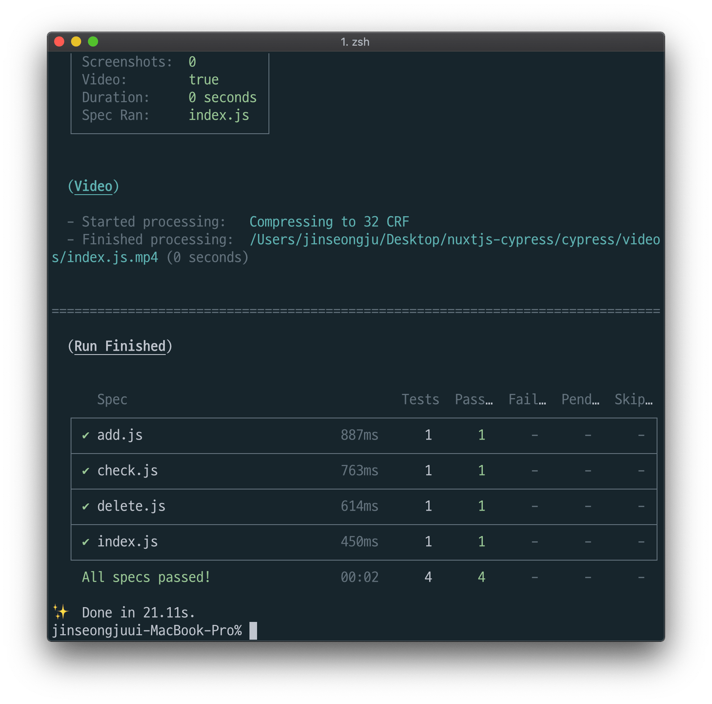
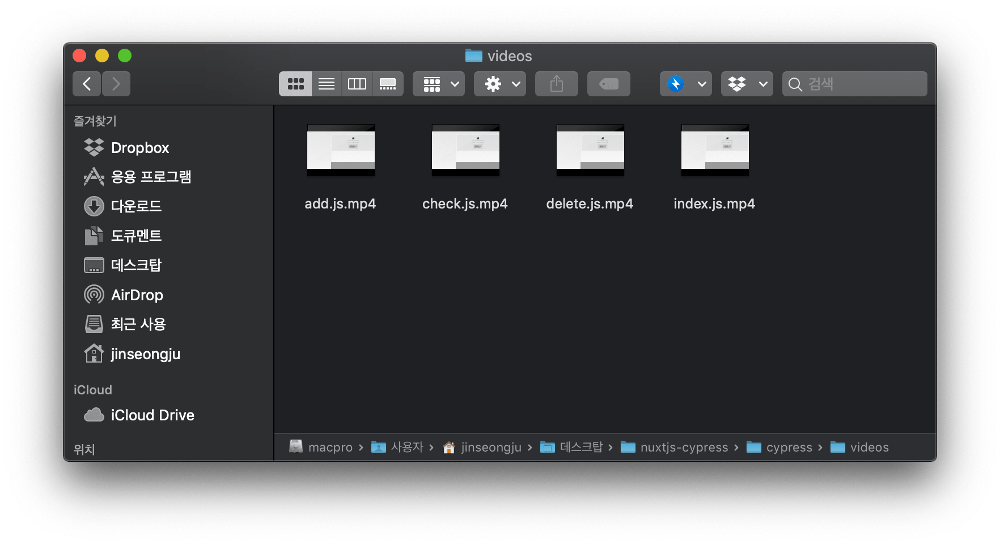
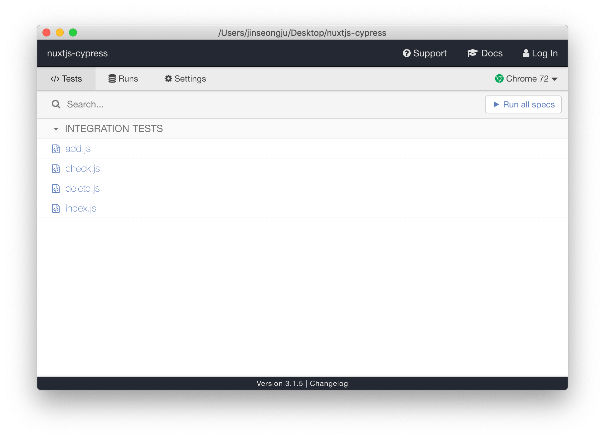
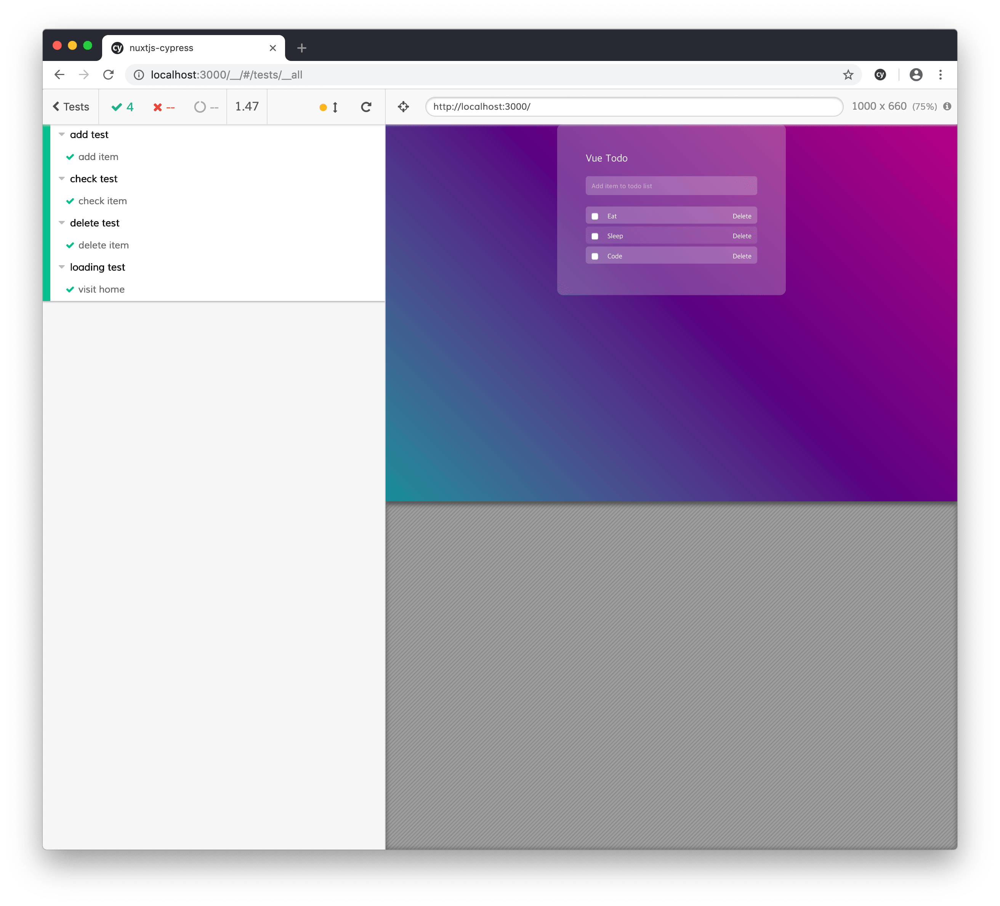

### 0. cypress란

https://www.cypress.io

cypress는 end to end test framework입니다
end to end test란 사용자 입장에서 테스트하는 것을 말합니다.

좀 더 자세한 것은 아래의 글을 읽어보시면 좋을거 같아서 링크 공유드립니다.

https://medium.com/hbsmith/e2e-test-알아보기-3c524862469d

필요한 이유는 여러가지이지만 일단 가장 큰 이유는 코드를 작성하고 테스트할때 휴대폰인증 등 노트북 자체에서는 다 할 수 없는 테스트를 제외하고는 e2e test(end to end test)로 해결 가능하기 때문에 생산성을 더 높일 수 있기 때문입니다.

### 1. cypress 설치

```bash
yarn add -D cypress
```

또는

```bash
npm i --save-dev cypress
```

### 2. cypress 폴더 설정

먼저 `cypress`라는 폴더와 그 아래에 `e2e`라는 폴더를 생성합니다.
이제 `integration`라는 폴더 아래 `index.js`를 생성해줍니다.

index.js에는 테스트 시나리오대로 넣어줍니다.
(아래의 공식문서를 확인하시면서 하시면 됩니다.)
https://docs.cypress.io/guides/core-concepts/writing-and-organizing-tests.html#Folder-Structure

예시)

```javascript
describe('loading test', () => {
  it('visit home ', () => {
    cy.visit('/')
    cy.get('h2').contains('Vue Todo')
  })
})
```

위의 내용을 대략적으로 설명드리자면 실제적으로 동작하는 부분은 아래 내용입니다,

```javascript
cy.visit('/')
cy.get('h2').contains('Vue Todo')
```

`cy.visit("/")`은 메인페이지 즉, pages 바로 아래 index.vue가 나오는 곳으로 접속되도록 하고
`cy.get("h2").contains("Vue Todo")`은 h2에 Vue Todo라는 텍스트가 포함되어 있는지를 체크합니다.

(이 것은 각자 프로젝트마다 다르게 설정하시면 되고 `integration`폴더 아래에 여러가지 js파일을 넣어서 여러가지 테스트 시나리오대로 넣어주시면 됩니다.)

### 3. cypress.json 설정

```json
{
  "baseUrl": "http://localhost:3000"
}
```

설정에 대해서 말씀드리면 `baseUrl`은 `cy.visit()`과 `cy.request()`을 실행시킬시 기본 url이라고 보시면 됩니다.
`cy.visit()`은 웹페이지 접속시 즉, 프론트 테스트시 사용하게 되고
`cy.request()`은 rest api 불러올시 사용하게 됩니다. 백엔드 테스트시 사용 가능하게 됩니다.
(보통은 이렇습니다만 다를 수 있습니다.)

### 4. package.json script 설정

아래 스크립트 설정을 package.json script에 추가적으로 설정해줍니다.

```json
"scripts": {
    "e2e": "cypress run",
    "e2e:open": "cypress open"
}
```

### 5. e2e 테스트 실행

먼저 테스트를 실행하기전에 local에서 프론트가 실행되고 있어야합니다.

```bash
yarn run e2e
```

또는

```bash
npm run e2e
```



실행하시면 위와 같이 테스트 결과가 나오게 됩니다.



스크린샷을 보시다싶이 실행 후에 `cypress/videos` 안에 `cypress/integration` 폴더안에서 설정한 테스트들이 실행된 영상을 보실 수 있습니다.

```bash
yarn run e2e:open
```

또는

```bash
npm run e2e:open
```

위의 명령어를 실행하시면 아래와 같이 cypress가 실행되게 됩니다.
위에서 했던 명령어와 다른점은 테스트시 보이고 보이지 않고의 차이인거 같습니다.



여기서 Run all specs를 누르시면 테스트가 실행되게 됩니다.



실행하시면 시스템상에 설치된 최신 크롬에서 해당 테스트가 실행되게 됩니다.

깃허브 주소 : https://github.com/seongjoojin/nuxtjs-cypress
