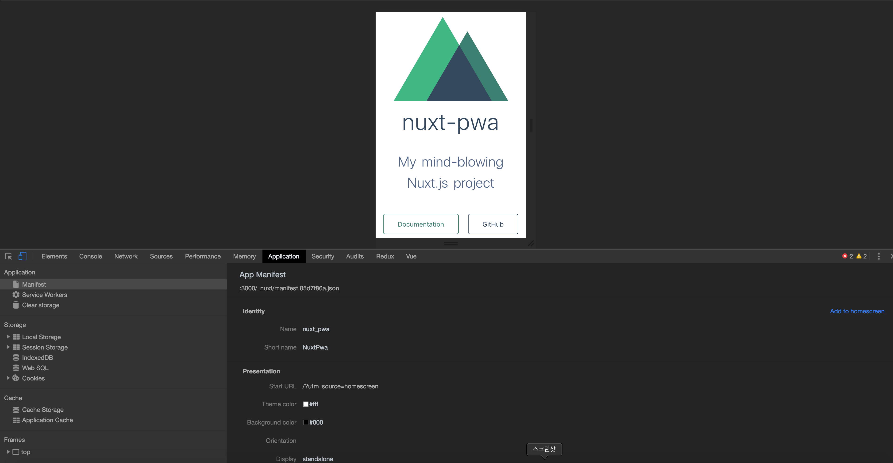
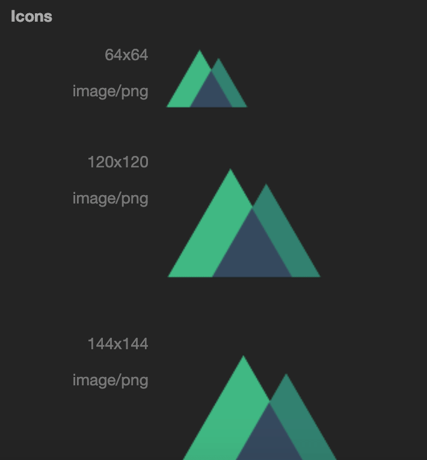
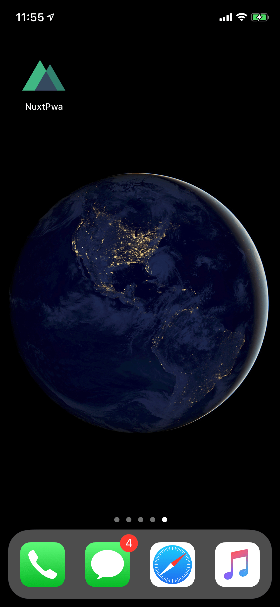
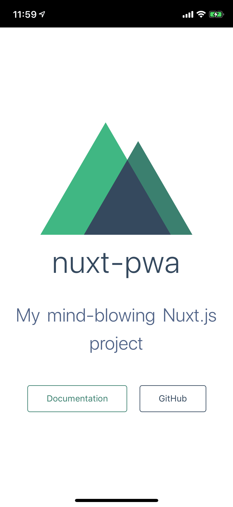

### 0. PWA란

PWA는 구글에서 밀고 있는 웹기술로 progress web app의 역자입니다.
대표적인 기능으로는 푸시 알람, 오프라인 지원, 앱 같이 설치 된다는 점입니다.

일단 저는 푸시 알람과 오프라인 지원은 완벽하게 지원되는 단계가 아닌 어떻게 도입할 수 있는지에 대해서 서술해보려고 합니다.

나중에 둘 다 도입 및 해결하게 되면 추가적으로 글을 적어보도록 하겠습니다.

### 1. nuxt 설치 및 pwa 모듈 설치

```bash
$ yarn create nuxt-app <my-project>
```

또는

```bash
$ npx create-nuxt-app <project-name>
```

설치 시에 `Choose features to install (Press <space> to select, <a> to toggle all, <i> to inverse selection)`를 물어보는데
`Progressive Web App (PWA) Support`를 스페이스바로 선택해주시고 설치하면 nuxt pwa 모듈이 자동으로 설치되게 됩니다.

기존 프로젝트에 추가하실려면 `@nuxtjs/pwa`을 설치하면 됩니다.

```bash
$ yarn add @nuxtjs/pwa
```

또는

```bash
$ npm i --save @nuxtjs/pwa
```

모듈 설치 후에 nuxt.config.js에 아래와 같이 추가로 설정해줍니다.

```javascript
modules: ['@nuxtjs/pwa']
```

### 2. manifest 설정

manifest는 아이콘, 이름, 보여줄 모양 등을 다양하게 설정해줄 수 있습니다. 원래는 json파일로 제공해야하지만 저희는 pwa모듈을 설치하였으므로 `nuxt.config.js`에서 설정해주시면 됩니다.

```javascript
manifest: {
    name: 'nuxt_pwa',
    short_name: 'NuxtPwa',
    start_url: '/?utm_source=homescreen',
    display: 'standalone',
    background_color: '#000'
}
```

하나씩 설명해드리겠습니다.

먼저 name은 앱 실행시에 로딩 화면에서 나올 이름입니다.

short_name는 앱 아이콘과 같이 나올 이름입니다.
start_url는 시작시에 접속할 url입니다. /가 pages폴더의 index.vue 입니다.
쿼리 문자열 매개변수를 추가하여서 사용자가 얼마만큼 pwa로 만든 앱을 쓰는지 추적할 수 있을 거 같습니다.

display 같은 경우는 이게 앱처럼 보일 것인지 웹처럼 보일 것인지 정합니다. 저희는 앱처럼 보이는게 중요하므로 standalone으로 설정해주시면 됩니다.

background_color은 앱 실행시 보이는 배경색을 지정해줄 수 있습니다.

추가적으로 manifest에서 icon을 원래 설정해주여 합니다만 저희는 static 폴더 안에 아이콘 파일만 넣어주면 됩니다.

png 형식이고 크기는 512pxX512px이상 이면 됩니다. 이름은 꼭 icon.png로 지정해주셔야 합니다.

원래는 192px인 파일과 512px인 파일을 두개 설정해주어야 실행시 나오는 아이콘과 앱 아이콘이 설정되게 되지만 이부분은 모듈이 알아서 설정해줍니다.

이제 크롬 개발도구 application탭으로 가시면 저희가 설정한 mainfest가 보이게 됩니다.




위에서 말씀드린 것처럼 모듈이 64px부터 512px까지 자동으로 설정해줍니다.

### 3. workbox설정

그 다음으로 설정할 것이 workbox입니다.
위에서 보셨던 application을 보시면 Service Workers라는 것이 보이실 것입니다.
Service Worker는 앱은 보통 이미지 등 사용할 리소스를 저장해두기에 오프라인에서도 사용 가능한데요.
이 저장하는 역할을 service worker가 해주게 됩니다.
Service Worker를 사용하기 쉽게 만든것이 workbox라고 합니다.

저희가 설치한 PWA 모듈은 이 workbox를 사용합니다.
일단 들어가기 앞서서 오프라인 지원을 제가 완벽하게 대응하지는 못 해서 추후에 진행사항이 있으면 글을 더 보강하도록 하겠습니다.
하지만 이것을 설정하는 이유는 일단 Service Worker가 설정되어야 홈화면에 추가하겠냐는 메세지가 브라우저에서 나올 수 있기 때문입니다.

그럼 설정해보도록 하겠습니다.
이것도 동일하게 `nuxt.config.js`에서 설정해주시면 됩니다.

```javascript
workbox: {
    offline: false,
    runtimeCaching: [
      {
        urlPattern: "/*",
        handler: "networkFirst",
        method: "GET"
      }
    ]
  },
```

일단 offline은 지원 안할 것이므로 false로 설정해줍니다.
기본적으로 `/_nuxt`아래에 있는 js를 저장하게 되는데 그거 외에 리소스들을 저장할 때에는 runtimeCaching를 사용하시면 됩니다.

### 4. 실행해보기

localhost 단에서 실행시켜보고 싶으시다면 `package.json`에서 script 부분에서 설정을 조금 변경해주시면 됩니다.
아래와 같이 설정해줍니다.

```json
"scripts": {
    "dev": "cross-env NODE_ENV=development nodemon server/index.js --watch server",
    "build": "nuxt build",
    "start": "HOST=0.0.0.0 PORT=3030 cross-env NODE_ENV=production node server/index.js",
    "generate": "nuxt generate"
}
```

start만 바꾸면 됩니다. `HOST=0.0.0.0`은 제 컴퓨터 말고 다른 외부에서도 접근할 수 있게끔 설정해준 것이고 `PORT=3030`은 3030포트를 사용하겠다는 설정입니다.
이제 nuxt를 실행하는 컴퓨터와 동일한 네트워크에 접속한 스마트폰에서 실행해주시면 바로가기 추가하라는 메세지와 앱처럼 실행되는 것을 보실 수 있으실 것입니다.

현재로서는 안드로이드&크롬에서만 제대로 동작하게 됩니다.
아이폰&사파리에서는 홈화면 추가로 추가 가능합니다. (https://zzarungna.tistory.com/1185)
아이폰의 경우에는 앱 실행시 보이는 화면이 안 나오고 바로가기 추가하라는 메세지도 안 나옵니다.
추후에 ios가 더 업데이트 되면 지원되지 않을까 싶습니다.





제 아이폰에서 실행한 모습입니다.
이상으로 nuxt pwa 적용기를 마치겠습니다.

깃허브 주소: https://github.com/seongjoojin/nuxtjs-pwa
