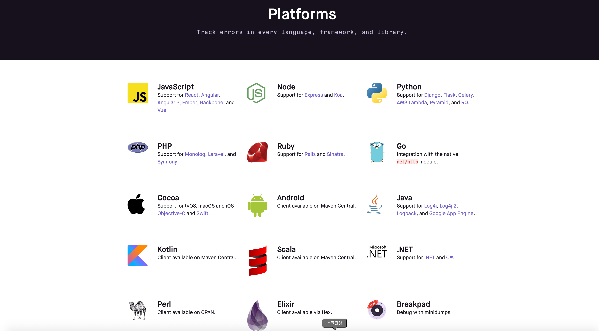
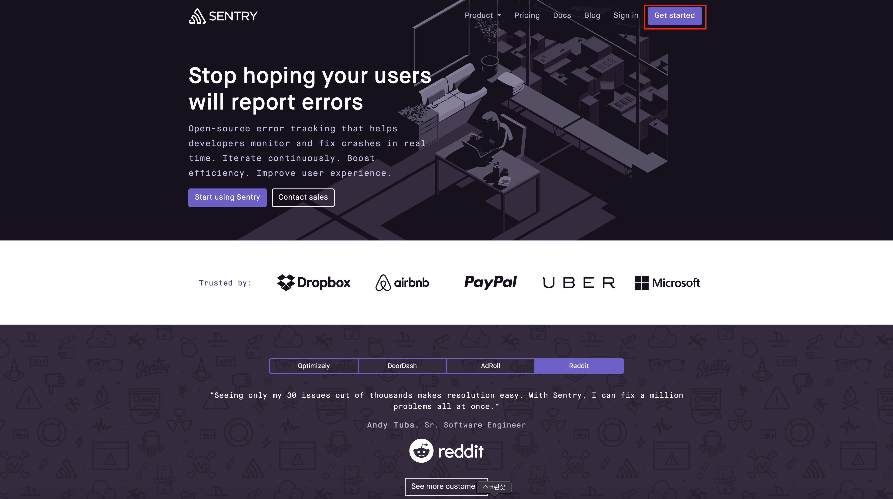
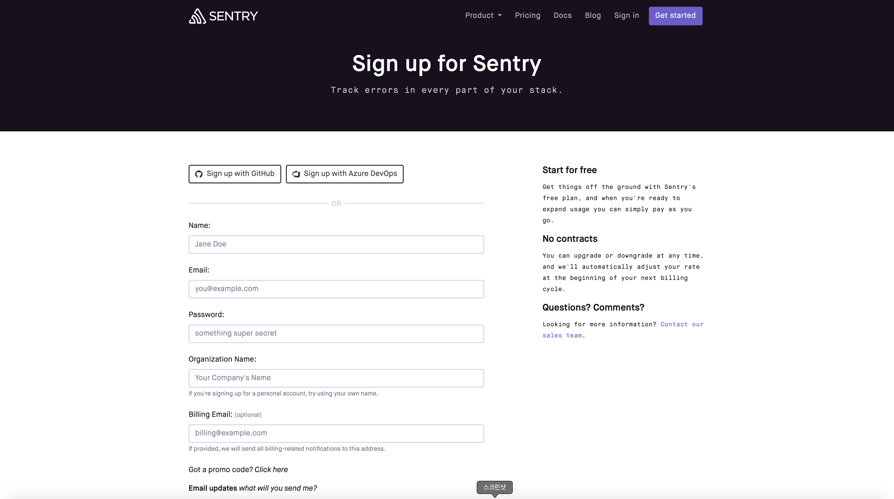
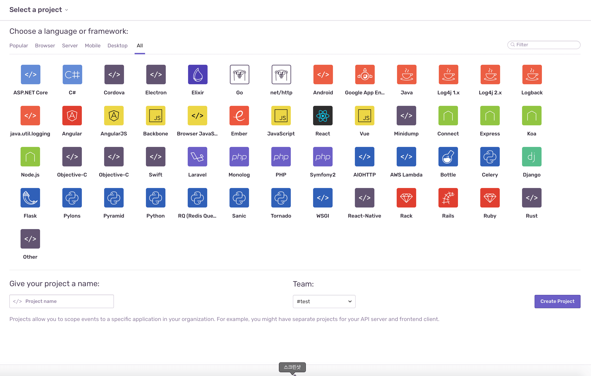
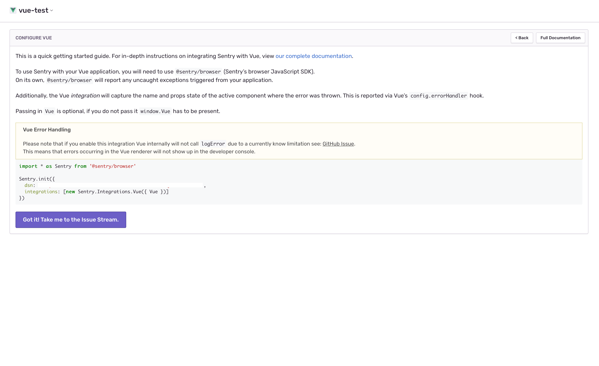
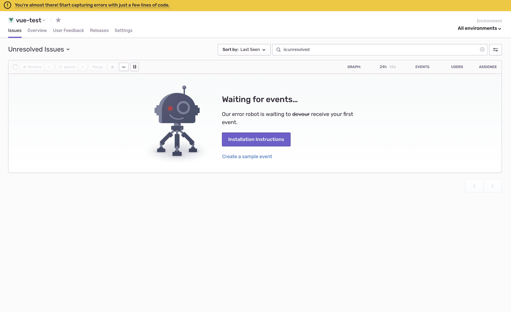
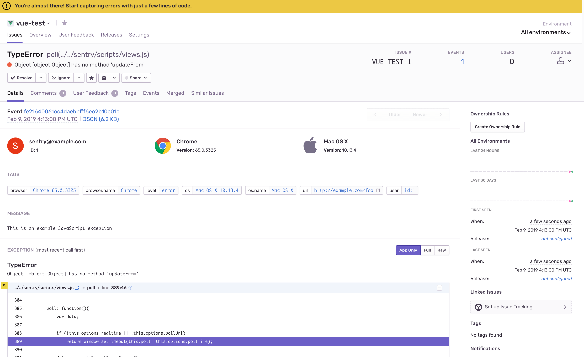
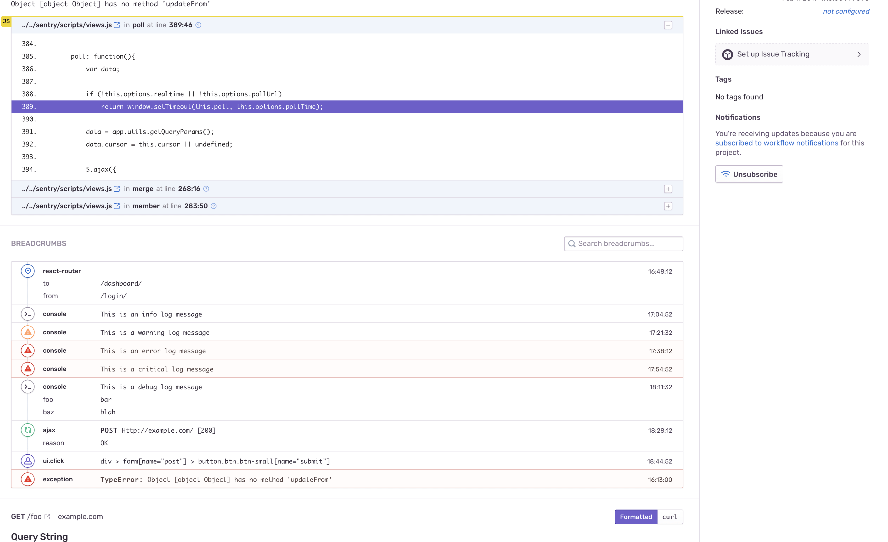
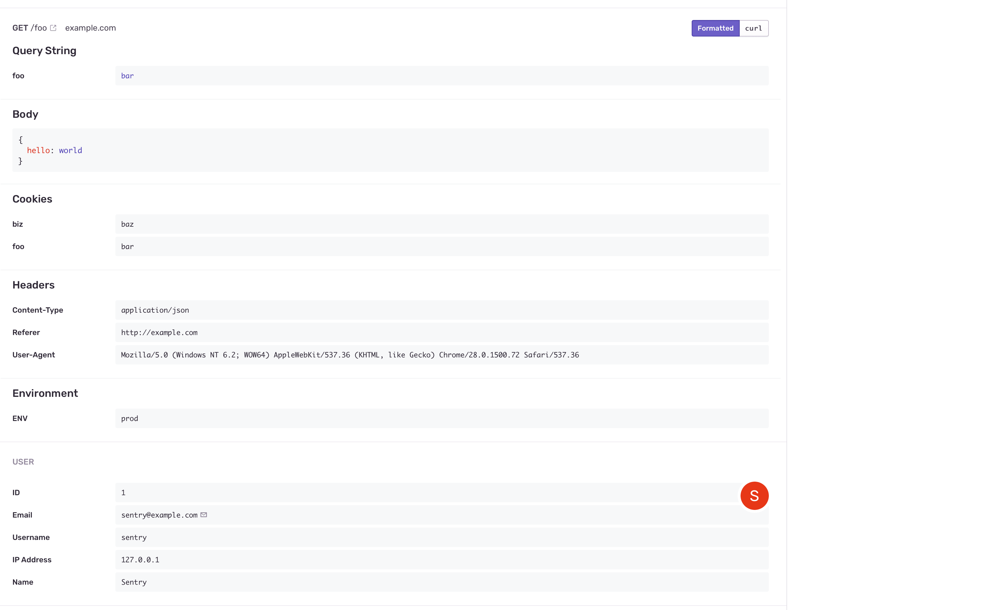
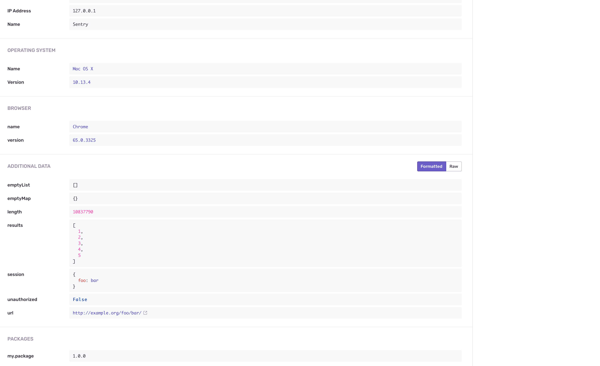

### 0. Sentry은 무엇인가

https://sentry.io/welcome/

sentry의 홈페이지를 보시면 아시겠지만 에러를 추적해주는 소프트웨어 입니다.
이게 왜 필요한가에 대해서는 애플리케이션을 만들고 출시하고 운영하다보면
애플리케이션을 사용하는 사용자가 에러난다고 피드백을 줄 때가 있다.

이런 피드백을 받을때 난감한 점은 유저가 어느때에 정확히 어떤 에러가 난건지 서술 안해줄 때가 있다는 것이다.
이런 불편함을 sentry로 해결해줄 수 있습니다.



또한 위의 스크린샷을 보시면 아시겠지만 엄청 많은 플랫폼에서 지원을 해주고 있습니다.

### 1. Sentry 모듈 설치

먼저 이 모듈은 현재 nuxt 1.0.0, 1.2.1 버전은 지원되지 않습니다.

nuxt에서는 sentry에 대한 모듈을 지원해주고 있습니다.
설치해보도록 하겠습니다.

`yarn add @nuxtjs/sentry`

또는

`npm i --save @nuxtjs/sentry`

### 2. Sentry 설정

sentry설정은 `nuxt.config.js`에서 하실 수 있습니다.
아래와 같이 먼저 설정해줍니다.

```javascript
modules: [
    '@nuxtjs/sentry',
],
sentry: {
    dsn: '',
    config: {}
}
```

### 3. Sentry 가입 및 dsn 키 발급

먼저 Sentry에 가입해보도록 하겠습니다.



먼저 Sentry 홈페이지에서 Get started를 누르시면 회원가입 화면으로 이동하실 수 있습니다.



다음과 같은 화면을 보실 수 있는데요. 회원가입해주도록 합니다. (가입시 메일로 검증해야하니 가입한 메일을 회원가입하고 확인해주세요.)

회원가입 하시고 로그인하면 다음과 같은 화면을 보실 수 있습니다.



vue를 선택하시고 프로젝트이름을 입력하시고 create project 버튼을 눌러서 프로젝트를 만드시면 dsn 키를 발급해줍니다.



위와 같이 dsn키를 발급되었으면 `nuxt.config.js`에서 넣어줍니다.

```javascript
sentry: {
    dsn: 'dsn key', // 여기에 발급된 키를 넣습니다.
    config: {}
}
```

바로 위 화면에서 Got it! Take me to the Issue Stream.버튼을 누르시면 아래와 같은 화면을 보실 수 있습니다.



이제 오류가 나면 위와 같은 화면을 보실 수 있습니다.

sample event를 한번 보도록 하겠습니다. (Create a sample event 버튼을 누르면 됩니다.)









정말 많은 내용을 보여줍니다.
어느 os, 브라우저, 무엇을 클릭했는지, 어느 페이지였는지, 오류 내용 이런 것들을 다 보여줌으로써 디버깅 하기 정말 편하게 해줍니다.
