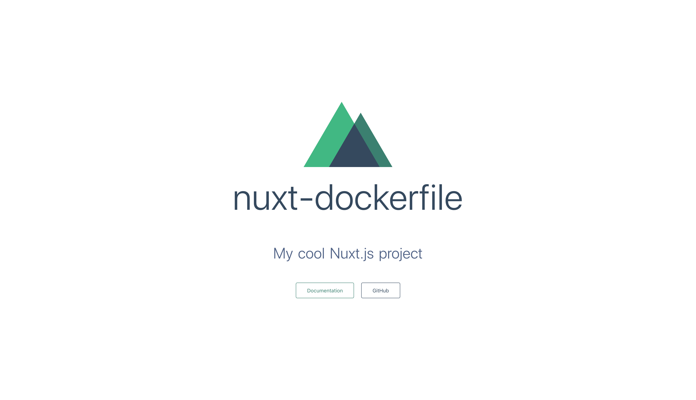

이번에는 nuxt를 도커 이미지를 만들어서 다음 프로젝트에서 사용하는 기본 뼈대가 되거나 aws 등의 클라우드에 도커 이미지를 올리는 등에 쓰일 수 있도록 이미지를 만들어 보도록 하겠습니다.

일단은 저는 초기 설치 후 이것을 이미지로 만들어서 다음 프로젝트에도 사용되는 기본 뼈대가 되도록 이미지를 떠보도록 하겠습니다.

### 0. Docker 설치

https://www.docker.com/get-started

위 링크를 참고하여서 설치하면 됩니다.

### 1. Nuxt.js 초기 설치

```shell s
$ yarn create nuxt-app <my-project>
```

또는

```shell
$ npx create-nuxt-app <project-name>
```

npx 명령어는 npm 5.2.0 버전 이후부터 실행 가능합니다.

먼저 nuxt를 설치합니다.

### 2. `Dockerfile` 작성&저장

설치한 프로젝트 폴더에 `Dockerfile`을 아래와 같이 작성하고 저장합니다.

```docker
FROM node:10

# Create app directory
WORKDIR /app
ADD . /app/

# global install & update
RUN npm i -g npm && npm i -g yarn

RUN rm yarn.lock
RUN rm package-lock.json
RUN yarn
RUN yarn build

ENV HOST 0.0.0.0
EXPOSE 3000

# start command
CMD [ "yarn", "start" ]
```

Dockerfile을 하나하나 설명하자면 아래와 같습니다.

`FROM node:10`

노드 10버전을 사용하도록 지정합니다.(해당하는 도커 이미지는 docker hub에서 불러집니다.) https://hub.docker.com/_/node/

```shell
WORKDIR /app
ADD . /app/
```

다음으로 컨테이너에서 /app 폴더로 이동합니다.
그 후 현재 폴더의 파일들(프로젝트 파일들)을 컨테이너의 /app 폴더로 옮깁니다.

`RUN npm i -g npm && npm i -g yarn`

다음으로 컨테이너 내에서 사용할 global 패키지를 설치합니다.
저 같은 경우에는 yarn을 사용하여서 설치하였고 npm도 업데이트 하였습니다.

```shell
RUN rm yarn.lock
RUN yarn
RUN yarn build
```

현재 파일에서 생성된 yarn.lock을 삭제합니다.
그 후 초기 설치 및 빌드를 실행해줍니다.

```shell
ENV HOST 0.0.0.0
EXPOSE 3000
```

모든 ip에 대해서 개방해주고 3000포트를 개방합니다.

### 3. `.dockerignore` 작성 및 저장

설치한 프로젝트 폴더에 `.dockerignore`을 아래와 같이 작성하고 저장합니다.

```shell
node_modules/
dist/
```

`.dockerignore` 파일은 docker 이미지 생성이 들어가지 않도록 설정하는 파일입니다.

### 4. docker image 생성

`docker build --tag <name>:version .`

ex) `docker build --tag nuxt:0.0.1 .`

docker image를 생성해줍니다. 여기서 --tag를 붙여준 이유는 맨 처음 말한것 처럼 초기 세팅도 되지만 클라우드에 올리는 용도 등으로 사용시 버전 관리하기 쉽고 구분하기 쉬워서 붙어주었습니다.

### 5. docker container로 실행

`docker run --name <container-name> -p 3000:3000 <image-name>:version`

ex) `docker run --name hello-nuxt -p 3000:3000 nuxt:0.0.1`

이제 http://loaclhost:3000로 접속해보시면 nuxt 초기 페이지가 나오게 됩니다.



만약 이 상태에서 `docker stop <container-name>`를 치시면 docker container 구동이 멈추고 3000번 포트로 가시면 연결할 수 없다고 나오게 됩니다.

github 주소 : https://github.com/seongjoojin/nuxtjs-dockerfile
