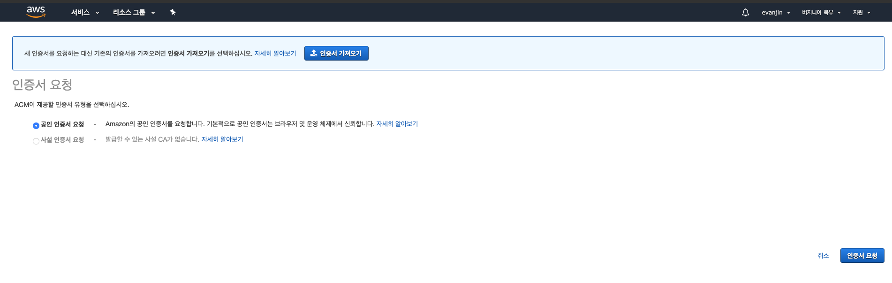
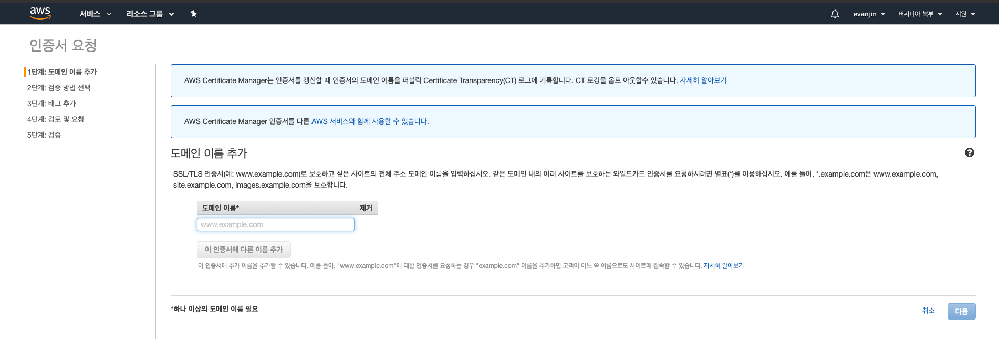
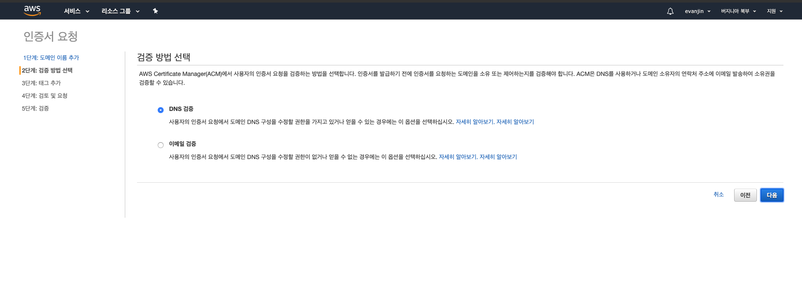
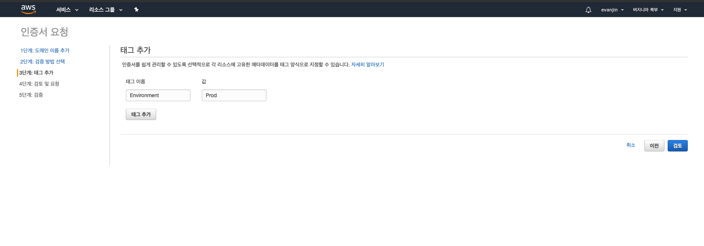
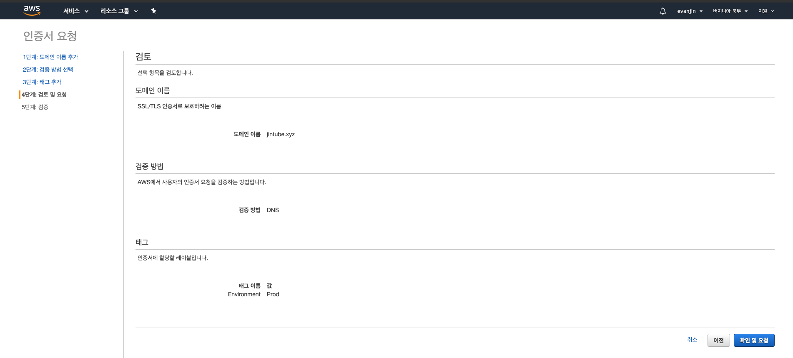
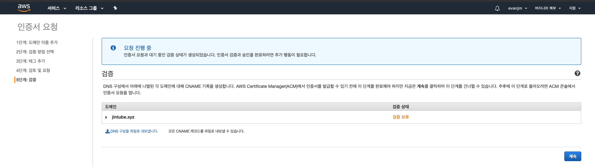

## 0. 도메인 구입

먼저 도메인을 구입하셔야 합니다.

제가 아는 한도내로 나열하자면 아래와 같습니다.

- [메가존](https://www.hosting.kr/)
- [가비아](https://domain.gabia.com/)
- [후이즈](https://whois.co.kr/)
- [GoDaddy](https://kr.godaddy.com/)
- [AWS Router53](https://aws.amazon.com/ko/route53/)
- [NameCheap](https://www.namecheap.com/)
- [name.com](https://www.name.com/) : 깃허브 학생 팩에서 도메인 하나를 무료로 증정해줍니다.

## 1. 인증서 등록

AWS Certificate Manager에서 위에서 구매한 도메인 연결하여 사용해보려고 합니다.

먼저 공인인증서 요청을 눌러서 진행해줍니다.

도메인 이름을 추가합니다.

만약 example.com이라면 아래와 같이 `example.com`와 `*.example.com`을 추가해주시면 됩니다.

검증 방법을 선택하라고 나옵니다.
저희는 DNS 검증으로 진행하려고 합니다.

태그를 추가하는 영역이 나오는데요.
특별히 추가하지 않아도 되는 것으로 보입니다.

확인 및 요청을 눌러줘서 진행해줍니다.

위 단계에서 나오는 CSV파일에 있는 CNAME Record의 Record Name, Record Value를 도메인 구입한 곳에서 등록해줍니다.

만약 등록에 문제가 있는 경우 아래의 링크를 참고해보시면 될 것 같습니다.

https://docs.aws.amazon.com/acm/latest/userguide/troubleshooting-DNS-validation.html
