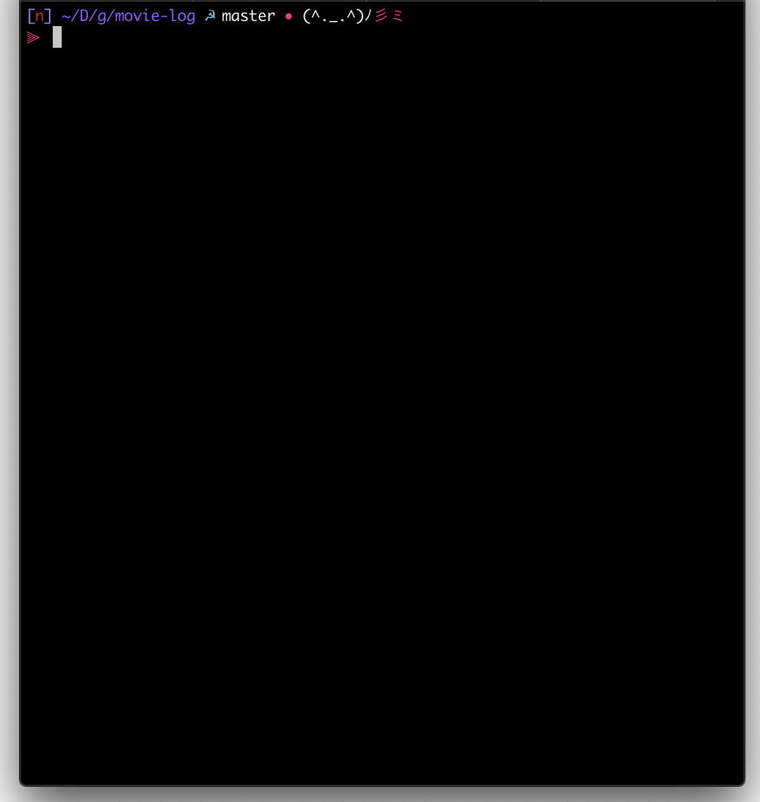

## 0. 왜 fishshell을 사용하였는가

먼저 맥에서 많이들 쓰고 계시는 zsh를 왜 버리고 fish를 사용하게 된 이유에 대해서 먼저 풀어보려고합니다.

당연하겠지만 저도 처음부터 zsh를 안 쓴건 아닙니다.
주변 mac os를 쓰시는 분들이 거의 대부분 zsh를 사용하기에 저도 설치 후 사용하였습니다.

하지만 저의 맥북에서는 zsh까지는 정상적으로 설치가 되었지만
oh my zsh나 zsh autosuggestions 등 부가적인 것들을 설치하면 바로 오류가 나오기도 하였고
oh my zsh 같은 경우는 저의 맥북에서 나오는 오류 등을 복사해서
바로 깃허브 이슈에도 달아봤지만 별다륵 소득이 없어서 기본적인 zsh만 깔고 사용하고 있었습니다.

그러다가 우연히 지인을 통해서 fishshell이라는 것을 알게되어서 옮기게 되었습니다.

저보다 더 잘 사용하시는 분이 더 많겠지만 저는 fishshell의 기본 자동완성과 oh my fish 테마가 너무 맘에 들어서 아직까지 잘 사용하고 있습니다.

## 1. fishshell 설치

설치 방법에는 여러 방법이 있지만 저는 맥북에 homebrew를 사용하기 때문에 homwbrew로 설치합니다.

```bash
$ brew install fish
```

리눅스나 윈도우에서도 설치할 수 있는 방법이 공식 홈페이지에 안내되어 있습니다.

https://fishshell.com

## 2. oh my fish 설치

zsh의 oh my zsh처럼 fishshell에도 oh my fish가 있습니다.
사실 oh my fish 추가되는 기능보다 사실 oh my zsh의 테마 중에 sushi가 너무 맘에 쏙 들어서 설치하게 되었습니다.

oh my fish는 터미널에서 아래와 같이 입력하여서 설치할 수 있습니다.

```bash
$ curl -L https://get.oh-my.fish | fish
```

또는 아래와 같이 설치도 가능합니다.

```bash
$ curl -L https://get.oh-my.fish > install
$ fish install --path=~/.local/share/omf --config=~/.config/omf
```

설치가 완료 되었디면 터미널에서 `omf`를 치시면 아래처럼 반응하여야 합니다.

```
$ omf
Oh My Fish! - the fish shell framework

USAGE
    omf [options] [<command>] [arguments]

DESCRIPTION
  Provides options to list, download and remove packages, update the framework,
  create a new package, etc.

COMMANDS
  cd            Change to root or package directory.
  channel       Get or change the update channel.
  describe      Show information about a package.
  destroy       Uninstall Oh My Fish.
  doctor        Troubleshoot Oh My Fish.
  help          Shows help about a command.
  install       Install one or more packages.
  list          List installed packages.
  new           Create a new package from a template.
  reload        Reload the current shell.
  remove        Remove a package.
  repositories  Manage package repositories.
  search        Search for a package or theme.
  theme         Install and list themes.
  update        Update Oh My Fish.
  version       Display version and exit.

OPTIONS
  -h, --help
    Display this help.

  -v, --version
    Display version and exit.

  For more information visit → https://git.io/oh-my-fish
```

## 3. oh my fish 테마 설치

oh my fish까지 무사히 설치하셨다면 이제 테마를 설치할 시간입니다.

oh my fish 테마의 종류는 아래의 링크에서 보실 수 있습니다.
https://github.com/oh-my-fish/oh-my-fish/blob/master/docs/Themes.md

저는 위의 언급 하였듯이 sushi 테마가 맘에 들지만 새로운 테마도 궁금하기에 slavic cat테마를 설치해보겠습니다.

```bash
omf install slavic-cat
```

설치 후 터미널 모습이 변한 것을 보실 수 있습니다.



slavic cat가 무사히 잘 적용된 모습입니다.

## 4. fishshell을 기본 shell로 변경

보통 맥은 bash가 기본 shell로 지정되어 있습니다.
하지만 저는 fishshell을 기본으로 사용하기 싶어서 방법을 찾았습니다.

먼저의 아래의 명령을 터미널에서 실행하면 fishshell의 위치가 나옵니다.

```bash
$ echo "/usr/local/bin/fish" | sudo tee -a /etc/shells
/usr/local/bin/fish
```

fishshell이 `/usr/local/bin/fish`에 위치하고 있다고 알려주고 있습니다.
chsh 명령어를 통해서 이제 변경해주도록 합니다.

```bash
chsh -s /usr/local/bin/fish
```

추가적으로 fishshell의 config를 가끔 변경해야할 일이 있을때 해당 config 파일이 어디 있는지 찾기 어려워서 기재두려고 합니다.
fishshell의 config 파일은 **~/.config/fish/config.fish** 위치하고 있습니다.
