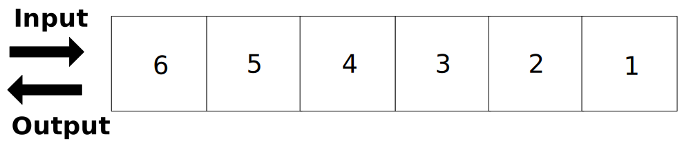
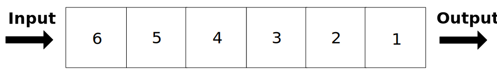
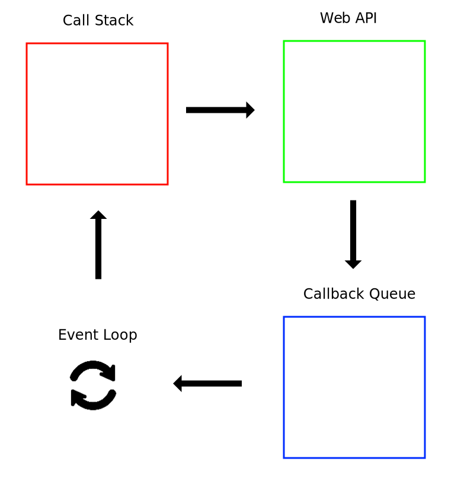
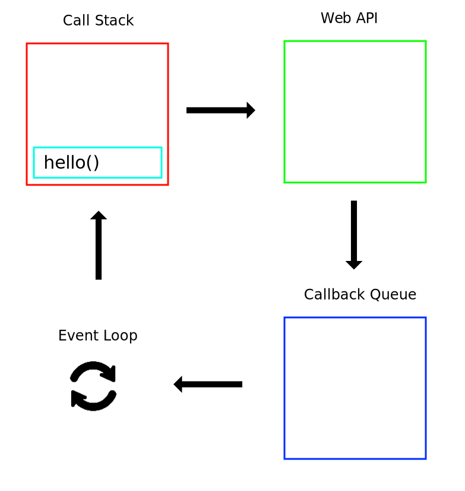
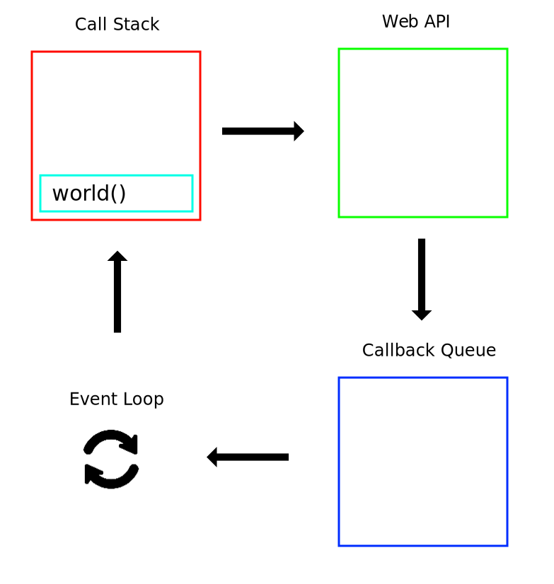
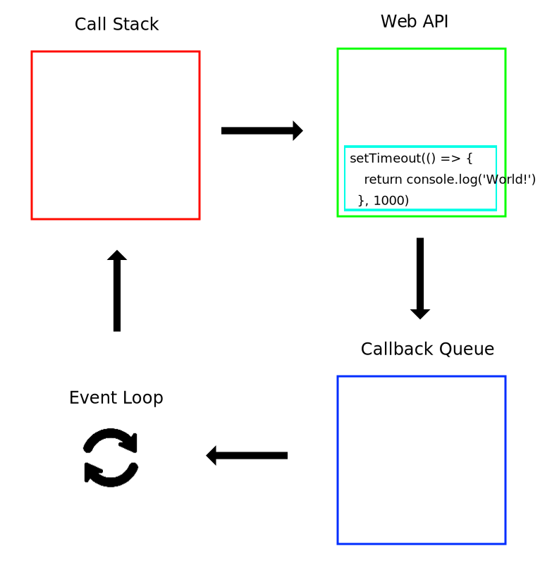
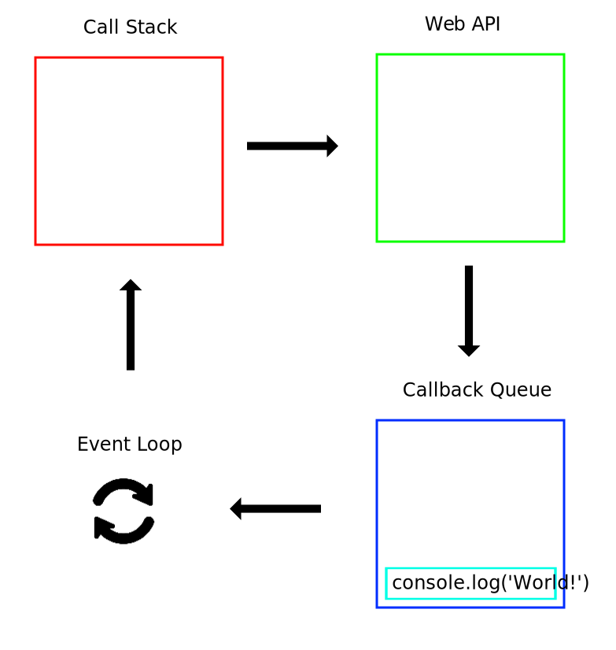
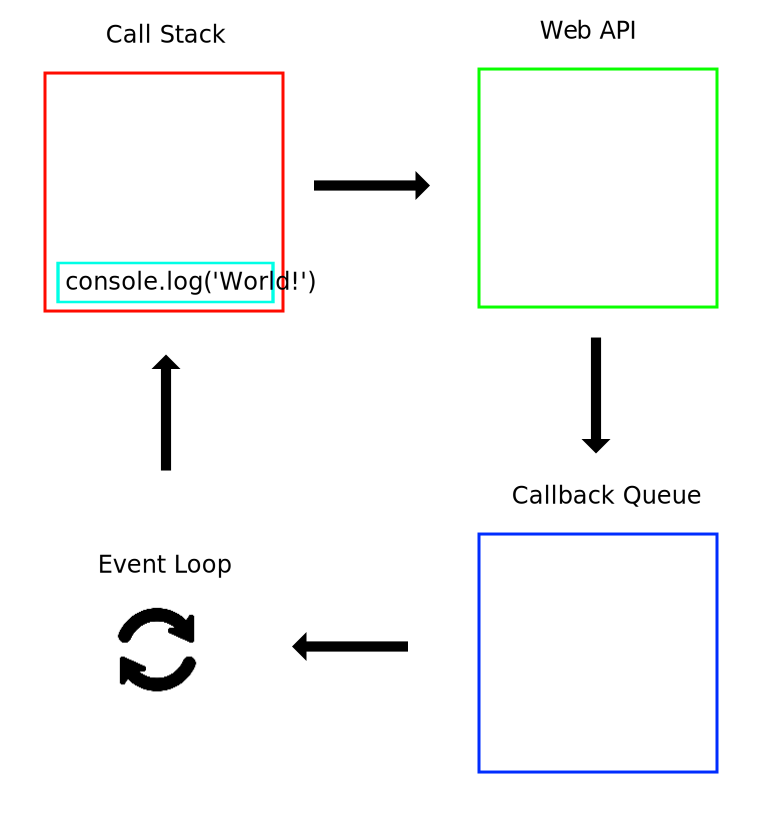

## 0. Stack과 Queue

먼저 Event Loop를 살펴보기 전에 두 가지의 자료구조를 알고 가야합니다.

Stack과 Queue인데요.

### 0-1. Stack



Stack은 마지막에 저장된 데이터를 가장 먼저 출력하는 데이터 구조입니다.

### 0-2. Queue



Queue는 줄서기와 동일하게 가장 먼저 입력된 데이터가 가장 먼저 출력되는 데이터 구조입니다.

## 1. Event Loop



하나씩 살펴보면 Call Stack은 함수의 실행 순서를 기록하기 위한 자료구조로 인터프리터가 한줄씩 실행합니다.
Web API는 웹브라우저의 api로 DOM, AJAX, Timer 처리를 담당합니다.
Callback Queue는 비동기 작업들이 들어가는 queue입니다.

Event Loop는 Call Stack을 감시하며 Call Stack이 비어있는 경우 Callback Queue에 있는 작업을 Call Stack으로 옮겨주는 역할을 합니다.

설명으로는 어려울 수 있으니 예시를 하나 들어보도록 하겠습니다.

### 1-1. 예시

```js
function hello() {
  return console.log('Hello')
}

function world() {
  return setTimeout(() => {
    return console.log('World!')
  }, 1000)
}

hello()
world()
```

위의 예시를 하나씩 살펴보도록 하겠습니다.



먼저 hello라는 함수가 실행되게 되고 자바스크립트 콘솔에서는 `Hello`가 출력되게 됩니다.



다음으로 world라는 함수가 실행되게 되는데 이때 world 함수가 리턴하는 setTimeout이 호출 되게 됩니다.
이 setTimeout은 Call Stack에 쌓이지 않고 Web API로써 처리 되게 됩니다.



1000ms가 지난 후에는 Web API에 담겼던 `console.log('World!')`가 Callback Queue로 옮겨지게 됩니다.



현재 Call Stack이 비어있기 때문에 Event Loop를 이를 감지하고 Callback Queue에 쌓여있는 `console.log('World!')`를 Call Stack으로 옮겨줍니다.



Call Stack에 있는 `console.log('World!')`는 인터프리터가 실행하게 되고 `World!`라는 출력이 나오게 됩니다.

## 2. 마치는말

위와 같이 자바스크립트는 동작하기 때문에 작업이 일어날때 다른 작업도 처리하는 비동기와 Non-blocking 특징을 가지게 됩니다.

이러한 특징은 자바스크립트라는 언어가 웹브라우저에서 동작하는 언어였기 때문에 가지는 특징입니다.
