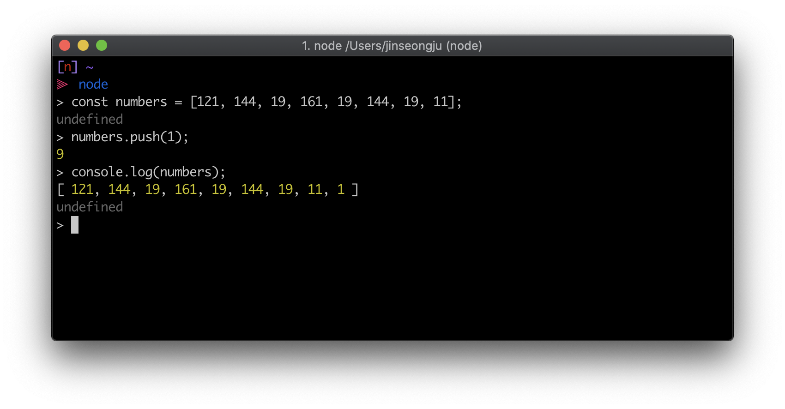

## 1. forEach

`forEach`는 for를 대체할 수 있는 내장함수입니다.

```javascript
const array = [121, 144, 19, 161, 19, 144, 19, 11]

array.forEach(item => {
  console.log('item', item)
})
```

위의 console은 아래와 같이 출력되게 됩니다.


forEach의 매개변수에는 현재 요소뿐만 아니라 index, array(호출한 배열)도 있습니다.

```javascript
const array = [121, 144, 19, 161, 19, 144, 19, 11]

array.forEach((item, index, array) => {
  console.log('item', item)
  console.log('index', index)
  console.log('array', array)
})
```

위의 console은 아래와 같이 출력되게 됩니다.


## 2. map

배열 안의 원소를 변환 할 때 사용되고 새로운 배열을 만듭니다.

```javascript
const array = [121, 144, 19, 161, 19, 144, 19, 11]
const mapArray = array.map(item => item * 2)

console.log(mapArray)
```

위의 console은 아래와 같이 출력되게 됩니다.


map의 매개변수도 forEach와 동일하게 index와 array가 존재합니다.

```javascript
const array = [121, 144, 19, 161, 19, 144, 19, 11]
const mapArray = array.map((item, index, arr) => {
  console.log('item', item)
  console.log('index', index)
  console.log('array', arr)
})
```

위의 console은 아래와 같이 출력되게 됩니다.


## 3. indexOf

원하는 항목을 몇번째 원소인지 찾아주는 함수입니다.

모든 인덱스를 반환하지는 않고 첫번째 인덱스만 반환합니다.

```javascript
const array = [121, 144, 19, 161, 19, 144, 19, 11]
console.log(array.indexOf(144))
console.log(array.indexOf(10))
```


## 4. findIndex

원하는 항목을 찾아주는 함수는 함수로 indexOf와 동일한 기능을 하지만 indexOf는 배열 안에 있는 값이 객체이거나 배열이면 찾을 수 없습니다.

```javascript
const todos = [
  {
    id: 0,
    completed: false,
    title: '녹차 사기',
    content: '개인적으로 좋아하는 녹차사기',
    createAt: 1560577682,
  },
  {
    id: 1,
    completed: false,
    title: '바퀴벌레약 설치해놓기',
    content: '여름이 다가왔으니 필수!',
    createAt: 1560577682,
  },
  {
    id: 2,
    completed: false,
    title: '닭가슴살 사기',
    content: '이번 일주일 동안 먹을 고기를 사자!',
    createAt: 1560577728,
  },
  {
    id: 3,
    completed: false,
    title: '수박 사자',
    content: '여름이 다가왔으니 필수!',
    createAt: 1560577682,
  },
]

const findIndex = todos.findIndex(item => item.title === '수박 사자')
console.log(findIndex)
```


## 5. find

findIndex와 동일하게 값을 찾아내지만 index를 반환하는게 아니라 값 자체를 반환합니다.

```javascript
const todos = [
  {
    id: 0,
    completed: false,
    title: '녹차 사기',
    content: '개인적으로 좋아하는 녹차사기',
    createAt: 1560577682,
  },
  {
    id: 1,
    completed: false,
    title: '바퀴벌레약 설치해놓기',
    content: '여름이 다가왔으니 필수!',
    createAt: 1560577682,
  },
  {
    id: 2,
    completed: false,
    title: '닭가슴살 사기',
    content: '이번 일주일 동안 먹을 고기를 사자!',
    createAt: 1560577728,
  },
  {
    id: 3,
    completed: false,
    title: '수박 사자',
    content: '여름이 다가왔으니 필수!',
    createAt: 1560577682,
  },
]

const find = todos.find(item => item.title === '수박 사자')
console.log(find)
```


## 6. filter

배열에서 특정 조건을 만족하는 값들만 따로 추출하여 새로운 배열을 만듭니다.

```javascript
const todos = [
  {
    id: 0,
    completed: false,
    title: '녹차 사기',
    content: '개인적으로 좋아하는 녹차사기',
    createAt: 1560577682,
  },
  {
    id: 1,
    completed: true,
    title: '바퀴벌레약 설치해놓기',
    content: '여름이 다가왔으니 필수!',
    createAt: 1560577682,
  },
  {
    id: 2,
    completed: false,
    title: '닭가슴살 사기',
    content: '이번 일주일 동안 먹을 고기를 사자!',
    createAt: 1560577728,
  },
  {
    id: 3,
    completed: true,
    title: '수박 사자',
    content: '여름이 다가왔으니 필수!',
    createAt: 1560577682,
  },
]

const filterItem = todos.filter(item => item.completed)
console.log(filterItem)
```


## 7. splice

배열에서 특정 항목을 제거할 때 사용합니다.

```javascript
const numbers = [121, 144, 19, 161, 19, 144, 19, 11]
numbers.splice(0, 4)
console.log(numbers)
```


## 8. slice

splice처럼 배열을 잘라낼때 사용되는데 기존의 배열을 건들지 않습니다.

```javascript
const numbers = [121, 144, 19, 161, 19, 144, 19, 11]
numbers.slice(0, 4)
console.log(numbers)
```


## 9. shift

shift는 첫번째 원소를 배열에서 추출합니다. (추출하는 과정에서 해당 원소가 사라집니다.)

```javascript
const numbers = [121, 144, 19, 161, 19, 144, 19, 11]
const value = numbers.shift()
console.log(value)
console.log(numbers)
```


## 10. pop

pop는 배열의 맨 마지막의 항목을 추출합니다. (추출하는 과정에서 해당 원소가 사라집니다.)

```javascript
const numbers = [121, 144, 19, 161, 19, 144, 19, 11]
const value = numbers.pop()
console.log(value)
console.log(numbers)
```


## 11. push

push는 배열의 맨 마지막에 새 항목을 추가합니다.

push가 반환하는 값은 호출하는 배열의 새로운 length 속성입니다.

```javascript
const numbers = [121, 144, 19, 161, 19, 144, 19, 11]
numbers.push(1)
console.log(numbers)
```



## 12. unshift

unshift는 배열의 맨 앞에 새 원소를 추가합니다.

```javascript
const numbers = [121, 144, 19, 161, 19, 144, 19, 11]
numbers.unshift(15)
console.log(numbers)
```


## 13. concat

여러개의 배열을 하나의 배열로 합쳐줍니다.

```javascript
const array1 = [121, 144, 19, 161]
const array2 = [19, 144, 19, 11]
const concatArray = array1.concat(array2)

console.log(concatArray)
```


## 14. join

배열 안의 값들을 문자열 형태로 합쳐줍니다.

```javascript
const array = [121, 144, 19, 161, 19, 144, 19, 11]
console.log(array.join())
console.log(array.join(''))
```


## 15. includes

배열에서 특정 요소를 포함하고 있는지 판별하는 함수입니다.

```javascript
const array = [121, 144, 19, 161, 19, 144, 19, 11]
console.log(array.includes(11))
console.log(array.includes(150))
```


## 16. reverse

배열의 순서를 반전합니다.

```javascript
const array = [121, 144, 19, 161, 19, 144, 19, 11]
console.log(array.reverse())
```


## 17. sort

배열의 요소를 정렬시킵니다. 정렬 순서는 문자열의 유니코드순서를 따릅니다.

```javascript
const months = [
  'January',
  'Febuary',
  'March',
  'April',
  'May',
  'June',
  'July',
  'August',
  'September',
  'October',
  'November',
  'December',
]
months.sort()
```


## 18. reduce

배열의 각 요소에 주어진 리듀서(reducer) 함수를 실행하고 하나의 결과 값으로 반환합니다.

```javascript
const array = [121, 144, 19, 161, 19, 144, 19, 11]
const reducer = (accumulator, currentValue) => accumulator + currentValue
console.log(array.reduce(reducer))
```


## 19. length

배열의 길이를 반환합니다.

```javascript
const array = [121, 144, 19, 161, 19, 144, 19, 11]
console.log(array.length)
```


