##### k8s prometheus, grafana

먼저 helm을 설치해줍니다

```bash
$ brew install kubernetes-helm
$ helm repo add stable https://kubernetes-charts.storage.googleapis.com/
"stable" has been added to your repositories
```

그 다음으로 prometheus 설치합니다.

```bash
$ helm install prometheus stable/prometheus
NAME: prometheus
LAST DEPLOYED: Thu Jan 23 10:36:50 2020
NAMESPACE: default
STATUS: deployed
REVISION: 1
TEST SUITE: None
NOTES:
The Prometheus server can be accessed via port 80 on the following DNS name from within your cluster:
prometheus-server.default.svc.cluster.local


Get the Prometheus server URL by running these commands in the same shell:
  export POD_NAME=$(kubectl get pods --namespace default -l "app=prometheus,component=server" -o jsonpath="{.items[0].metadata.name}")
  kubectl --namespace default port-forward $POD_NAME 9090


The Prometheus alertmanager can be accessed via port 80 on the following DNS name from within your cluster:
prometheus-alertmanager.default.svc.cluster.local


Get the Alertmanager URL by running these commands in the same shell:
  export POD_NAME=$(kubectl get pods --namespace default -l "app=prometheus,component=alertmanager" -o jsonpath="{.items[0].metadata.name}")
  kubectl --namespace default port-forward $POD_NAME 9093
#################################################################################
######   WARNING: Pod Security Policy has been moved to a global property.  #####
######            use .Values.podSecurityPolicy.enabled with pod-based      #####
######            annotations                                               #####
######            (e.g. .Values.nodeExporter.podSecurityPolicy.annotations) #####
#################################################################################


The Prometheus PushGateway can be accessed via port 9091 on the following DNS name from within your cluster:
prometheus-pushgateway.default.svc.cluster.local


Get the PushGateway URL by running these commands in the same shell:
  export POD_NAME=$(kubectl get pods --namespace default -l "app=prometheus,component=pushgateway" -o jsonpath="{.items[0].metadata.name}")
  kubectl --namespace default port-forward $POD_NAME 9091

For more information on running Prometheus, visit:
https://prometheus.io/
```

helm으로 설치 한 후 안내 해준대로 실행해줍니다.

```bash
$ export PROMETHEUS_POD_NAME=$(kubectl get pods --namespace default -l "app=prometheus,component=server" -o jsonpath="{.items[0].metadata.name}")
$ minikube kubectl port-forward $PROMETHEUS_POD_NAME 9090
```

실행 후 `http:localhost:9090`으로 접속하시면 아래와 같은 화면을 보실 수 있습니다.

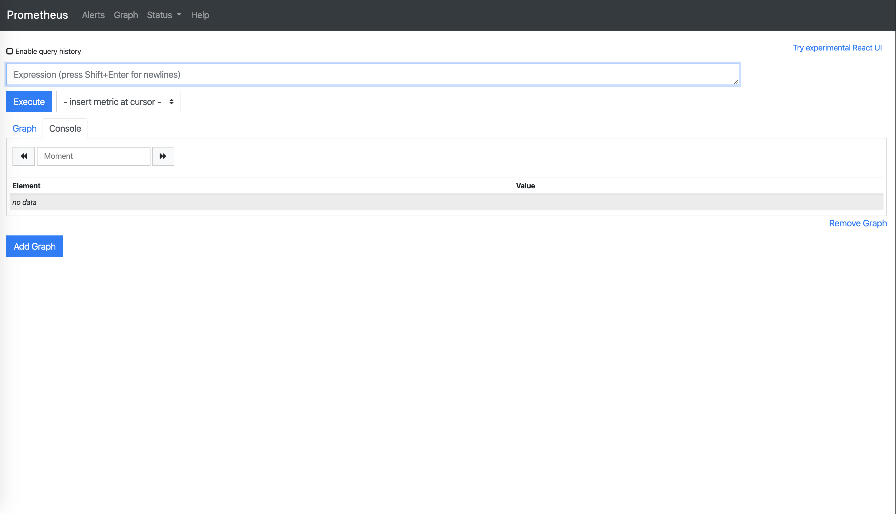

마지막으로 grafana를 설치합니다.

```bash
$ helm install grafana stable/grafana
NAME: grafana
LAST DEPLOYED: Thu Jan 23 11:04:55 2020
NAMESPACE: default
STATUS: deployed
REVISION: 1
NOTES:
1. Get your 'admin' user password by running:

   kubectl get secret --namespace default grafana -o jsonpath="{.data.admin-password}" | base64 --decode ; echo

2. The Grafana server can be accessed via port 80 on the following DNS name from within your cluster:

   grafana.default.svc.cluster.local

   Get the Grafana URL to visit by running these commands in the same shell:

     export POD_NAME=$(kubectl get pods --namespace default -l "app=grafana,release=grafana" -o jsonpath="{.items[0].metadata.name}")
     kubectl --namespace default port-forward $POD_NAME 3000

3. Login with the password from step 1 and the username: admin
#################################################################################
######   WARNING: Persistence is disabled!!! You will lose your data when   #####
######            the Grafana pod is terminated.                            #####
#################################################################################
```

안내해주는대로 진행해보도록 하겠습니다.

먼저 admin 계정에 부여된 비밀번호를 조회합니다.

```bash
$ kubectl get secret --namespace default grafana -o jsonpath="{.data.admin-password}" | base64 --decode ; echo
yZfmQnYG70Xq0KpQpPe36Sy99F3qMXgzWoyeouUd
```

이제 grafana를 실행해봅니다.

```bash
$ export GRAFANA_POD_NAME=$(kubectl get pods --namespace default -l "app=grafana,release=grafana" -o jsonpath="{.items[0].metadata.name}")
$ minikube kubectl port-forward $GRAFANA_POD_NAME 3000
```

실행 후 `http://localhost:3000`에 접속하면 아래와 같은 화면이 나오게 됩니다.

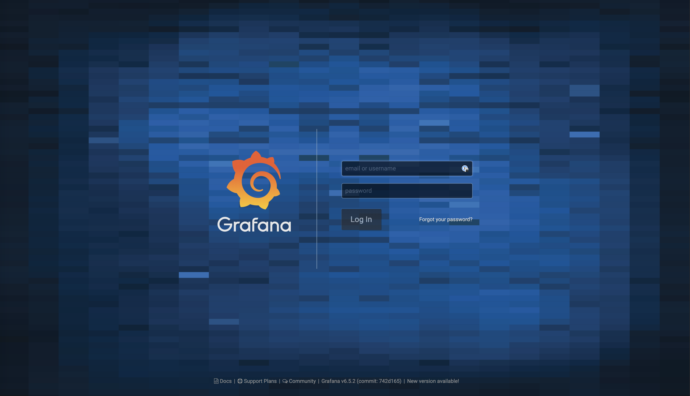

위 화면에서 username은 admin으로 하시고 password는 위에서 조회한 비밀번호를 입력해주시면 됩니다.

##### 3. grafana dashboard

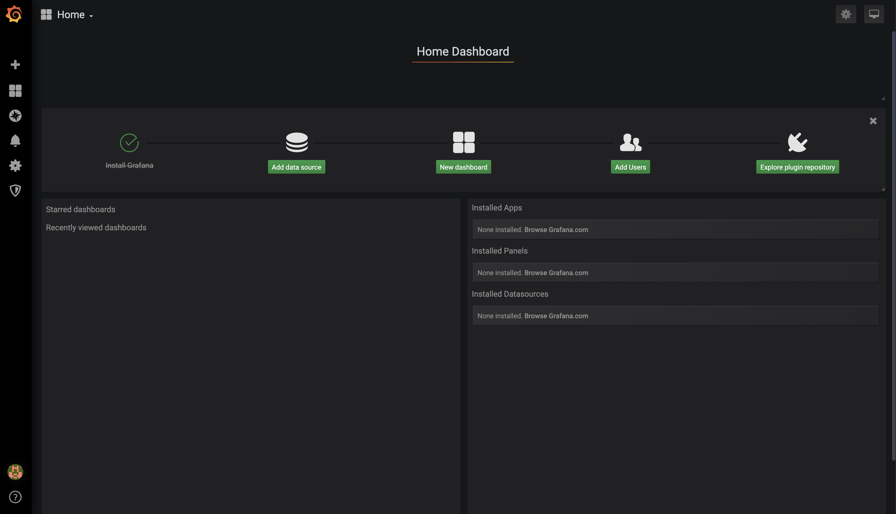

grafana에 로그인하시면 위와 같은 화면을 보실 수 있습니다.
여기서 `Add data source`를 해줍니다.

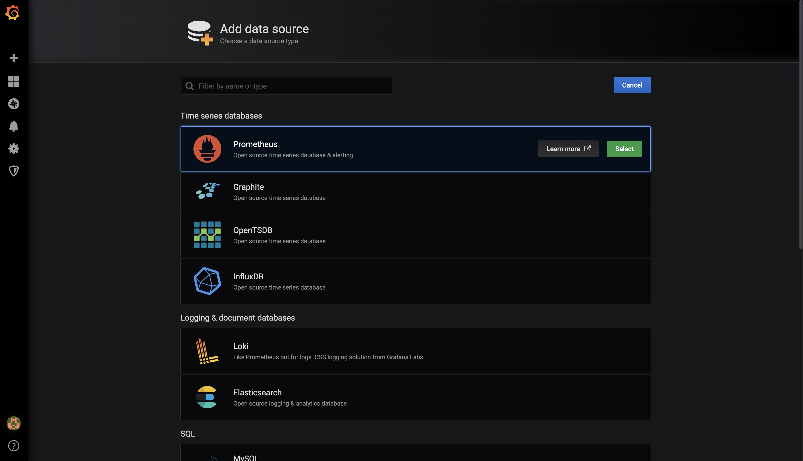

그 다음으로 나오는 화면에서 `promethous`를 선택해줍니다.

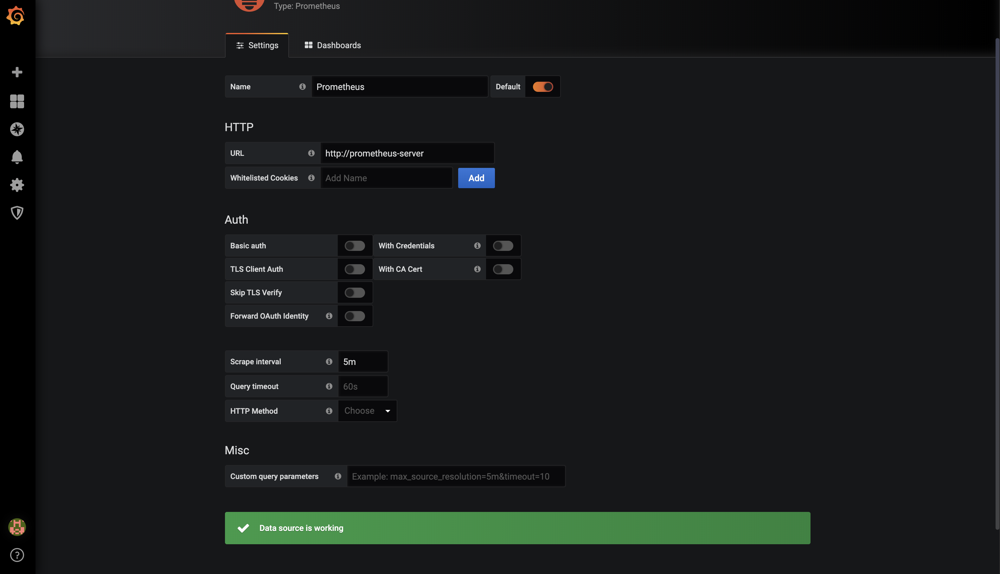

선택하시면 위와 같은 화면이 나오게 되는데요.
URL에 `http://prometheus-server`를 입력해주시고 `Sava & Test`버튼을 눌러줍니다.

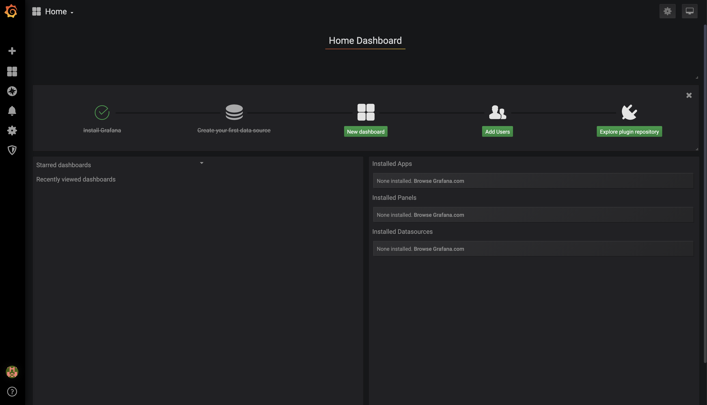

다음으로 home으로 돌아오셔서 New dashboard를 눌러줍니다.

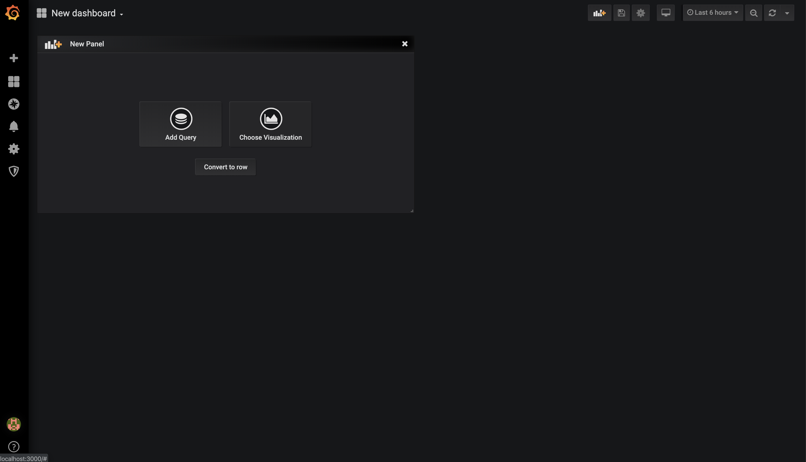

누르시면 위과 같은 화면이 나오게 되는데요.
`Add Query`을 눌러줍니다.

prometheus에서는 기본적으로 PromQL(https://prometheus.io/docs/prometheus/latest/querying/basics/)를 사용합니다.

공식홈페이지를 통해서 익히시고 원하시는 데이터를 주어지는 차트로 구현하시면 됩니다.

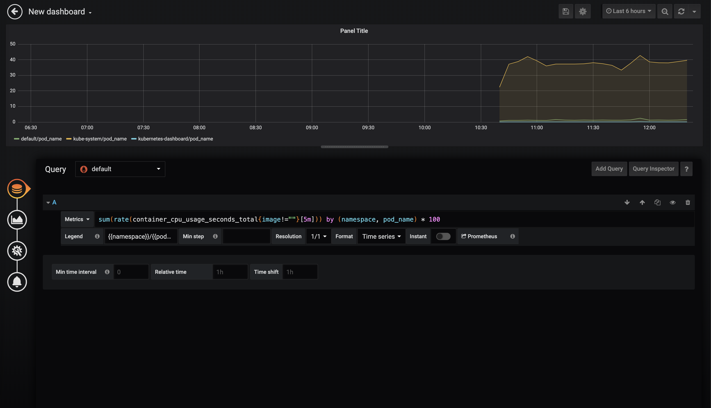

저는 각 pod들의 cpu 사용량을 5분마다 계측하고 표시해주는 쿼리를 입력하였습니다.

Metrics에는 `sum(rate(container_cpu_usage_seconds_total{image!=""}[5m])) by (namespace, pod_name) * 100`를 넣어주시고
Legend에는 `{{namespace}}/{{pod_name}}`를 넣어줍니다.

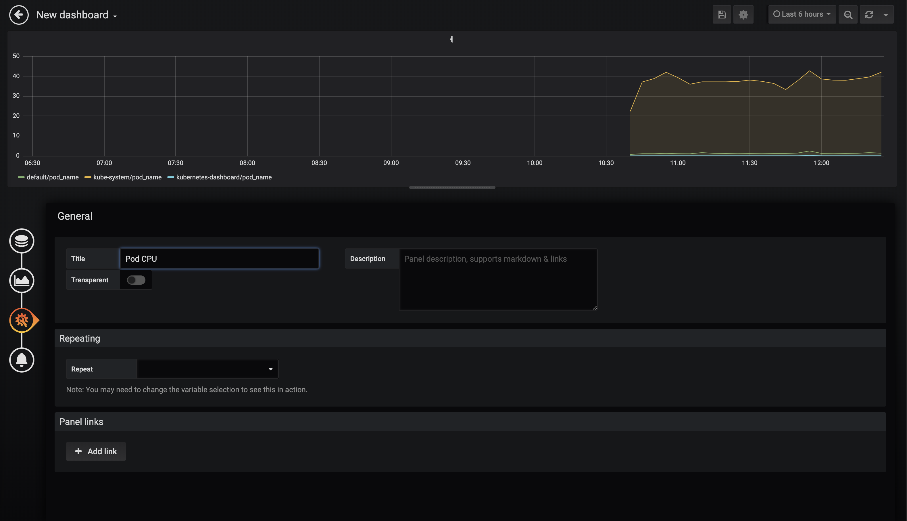

이름은 적절한 것으로 넣어주시면 됩니다.

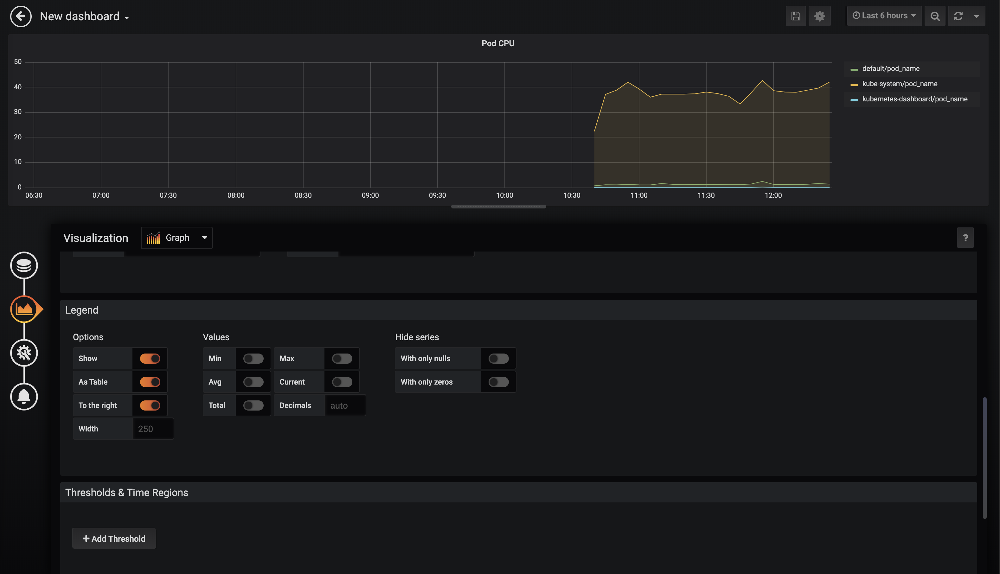

Legend Options에서 As Table과 To the right를 활성화해주시면 위과 같이 보기좋게 됩니다.
이제 오른쪽 위에 있는 저장 버튼을 눌러줍니다.

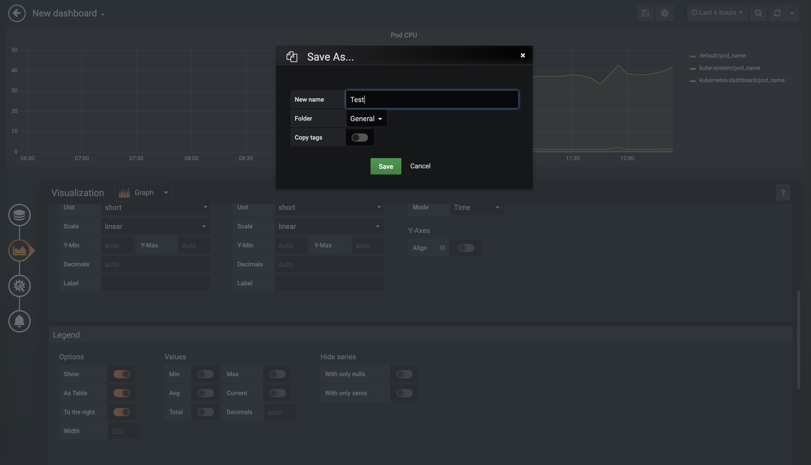

이름은 적절한 것으로 넣어주시면 됩니다.

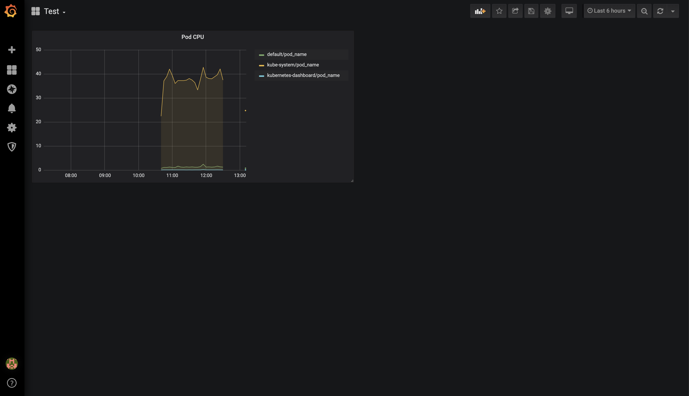

저장하면 위와 같이 대시보드가 나오게 됩니다.

만약 메모리도 보고싶다면 `sum(container_memory_usage_bytes{image!=""})by(namespace, pod_name)`로 metric에 추가하여서 보시면 됩니다.

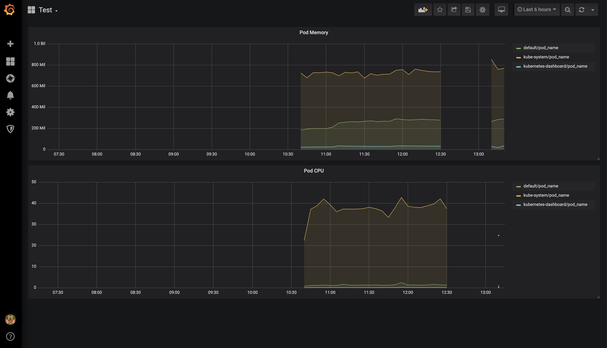

만약 구성하기가 어렵다면 아래 링크와 같이 많은 사람들이 만들어놓은 템플릿을 추가하셔서 보셔도 될거 같습니다.
https://grafana.com/grafana/dashboards/315
