## 0. 구성

본 포스팅에서는 마스터노드 한 개와 워커노드 두 개로 구성되도록 실습해보려고 합니다.

## 1. Virtualbox 설치

homebrew를 이용하여서 virtualbox를 설치해보도록 하겠습니다.

```shell
$ brew cask install virtualbox
$ brew cask install virtualbox-extension-pack
```

## 2. Ubuntu ISO 파일 다운로드

공식홈페이지도 있지만 보통 느린 관계로 부경대에서 제공하는 image를 다운 받도록 하겠습니다.

http://cdimage.ubuntu.com/ubuntu-server/bionic/daily/current/

위의 주소로 접속해서 받으면 됩니다.

## 3. VM 생성

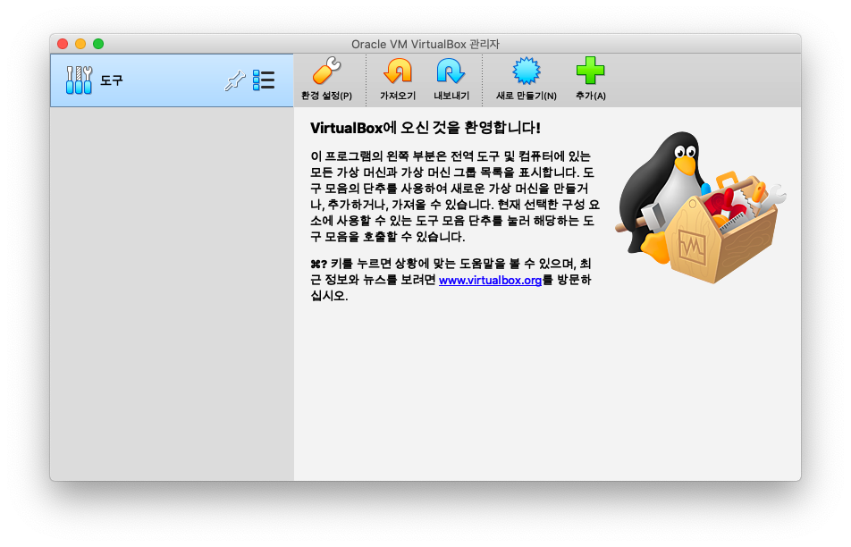

먼저 virtualbox를 실행해줍니다.

위에서 새로 만들기를 누르면 아래와 같이 vm을 만드는 화면이 나옵니다.

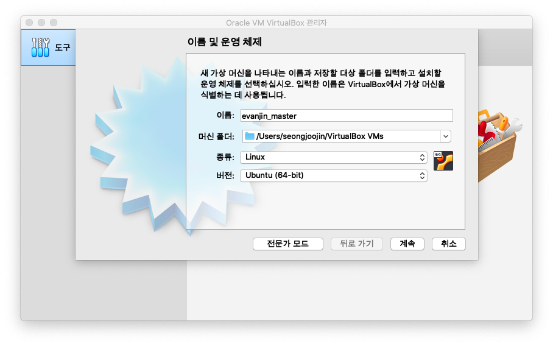

위와 같이 설정해줍니다. 저는 우분투를 사용하려고 위와 같이 설정하였습니다.

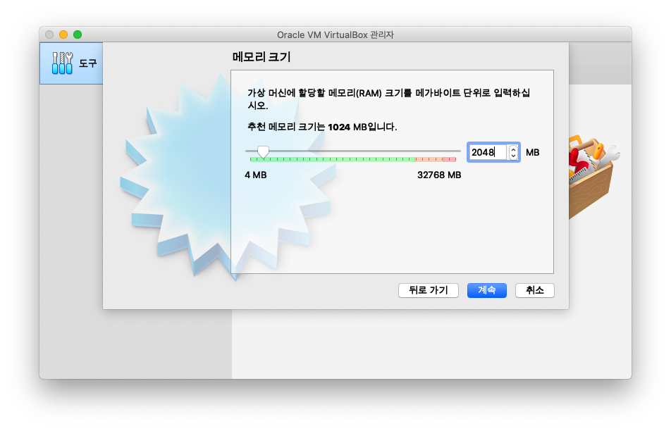

메모리는 2048MB로 설정해줍니다.

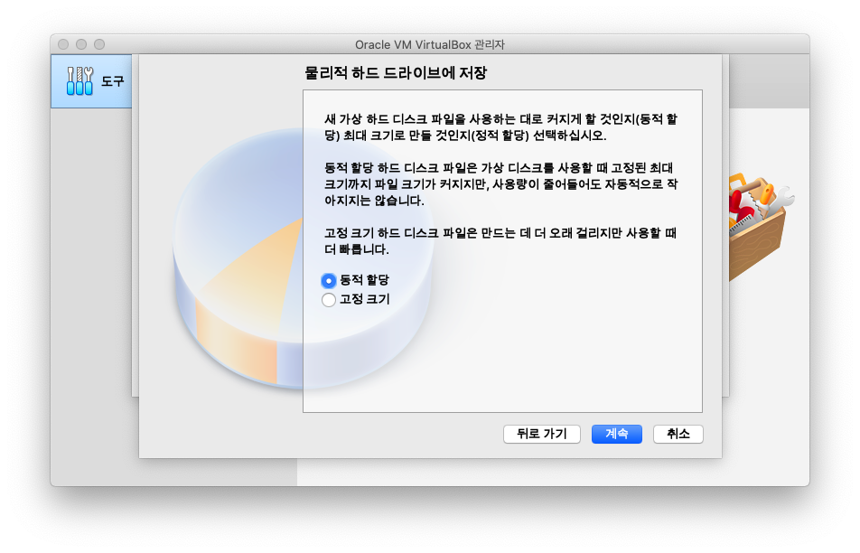

나머지는 계속을 눌러서 진행해주시고 물리적 하드드라이브에 저장하는 방식을 동적 할당이 아닌 고정크기로만 설정해주시면 됩니다.
크기는 추천하는 10GB로 설정해줍니다.

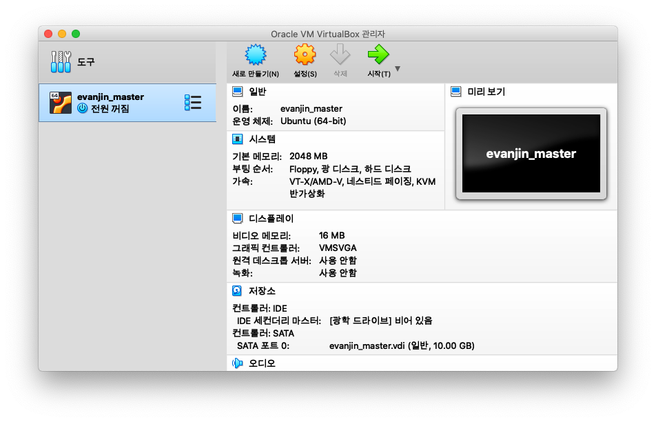

생성되면 위와 같이 VM이 하나 생성되었음을 보실 수 있습니다.
생성된 VM에서 오른쪽 마우스를 누르면 설정을 보실 수 있는데요.
설정으로 들어가서 필요한 몇가지 설정을 해보도록 하겠습니다.

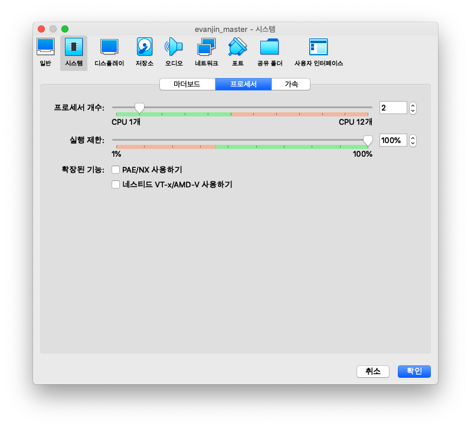

먼저 시스템 - 프로세서에서 cpu갯수를 2개로 늘려줍니다.

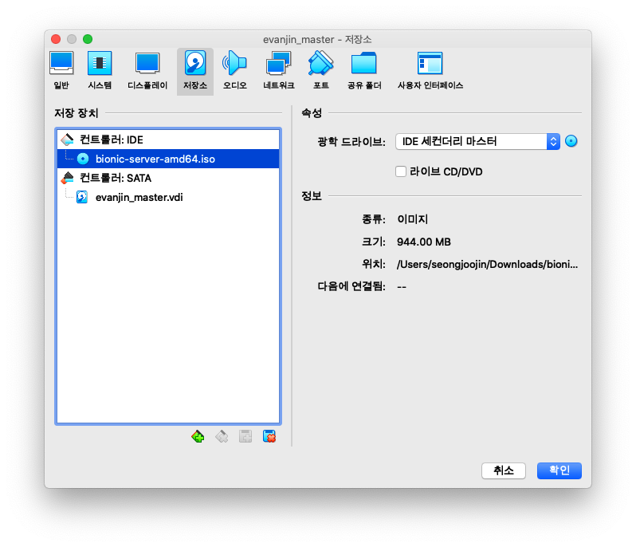

다음으로 저장소에서 광학 드라이브에서 위에서 다운 받았던 우분투 이미지를 선택해줍니다.

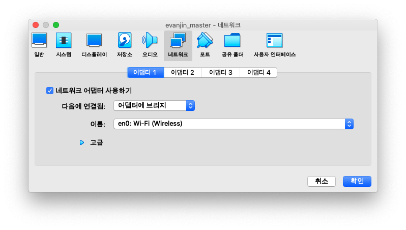

마지막으로 네트워크에서 어댑터 1번을 어댑터에 브리지로 선택해줍니다.

## 4. Ubuntu 설치

대부분 무난하게 설치 가능하실거 같으므로 설치과정을 상세하게 스크린샷으로 남기지는 않았습니다.

지금 설치한 것을 master로 설정할 것이기 때문에 이름만 blabla-master로 해주시면 됩니다.
이름 정하기 어려우시면 k8s-master도 무난해보입니다.

우분투 18 lts 이하로는 아래의 방법으로 설정해주시면 됩니다.

설치완료되고 재부팅 후에는 `/etc/network/interfaces`를 아래와 같이 수정해줍니다.

```
auto lo
iface lo inet loopback

auto eth0
iface eth0 inet static
address 192.168.0.10
netmask 255.255.255.0
network 192.168.0.0
broadcast 192.168.0.255
gateway 192.168.0.1

dns-nameservers 1.1.1.1 8.8.8.8
```

eth0의 경우 `ls /sys/class/net` 명령어를 통해서 이름이 제대로 되었는지 확인 후 다르다면 해당 이름으로 변경해주어야 합니다.

ifupdown 패키지를 설치 후 네트워크를 재시작 해주어 위의 설정을 적용해줍니다.

```shell
$ sudo apt-get install ifupdown
```

```shell
$ sudo /etc/init.d/networking restart
```

위와 같이 설정 후에도 `ifconifg` 명령 실행시 192.168.0.10로 나오지 않는다면 재부팅 해주시면 적용됩니다.

우분투 18 lts부터는 설정방식이 변경되어서 아래와 같이 진행해주시면 됩니다.

먼저 interface 목록을 확인합니다.

```shell
$ ls /sys/class/net
```

확인 후 설정파일을 엽니다.

```shell
$ sudo nano /etc/netplan/50-cloud-init.yaml
```

위의 파일을 아래의 내용으로 채우고 저장합니다. 여기서 eth0은 interface 목록 확인한 것으로 변경해주시면 됩니다.

```yaml
network:
  ethernets:
    eth0:
      addresses: [192.168.0.10/24]
      gateway4: 192.168.0.1
      nameservers:
        addresses: [1.1.1.1, 8.8.8.8]
      dhcp4: no
  version: 2
```

위와 같이 설정 후 저장하고 설정을 반영합니다.

```shell
sudo netplan apply
```

## 5. Kubernetes & Docker 설치 전 설정

**스왑 메모리 비활성화**

```shell
$ swapoff -a && sed -i '/ swap / s/^/#/' /etc/fstab
```

## 6. Docker 설치

```shell
# 패키지 관리 도구 업데이트
$ sudo apt update && sudo apt-get update

# docker 설치에 필요한 라이브러리 설치
$ sudo apt-get install apt-transport-https ca-certificates curl software-properties-common -y

# gpg key 내려받기
$ curl -fsSL https://download.docker.com/linux/ubuntu/gpg | sudo apt-key add -

# 다운받은 key 확인
$ sudo apt-key fingerprint 0EBFCD88

# 도커 다운로드 링크 추가
$ sudo add-apt-repository "deb [arch=amd64] https://download.docker.com/linux/ubuntu $(lsb_release -cs) stable"

# 패키지 관리 도구 업데이트
$ sudo apt-get update

# docker 설치
$ sudo apt-get update && sudo apt-get install \
  containerd.io=1.2.10-3 \
  docker-ce=5:19.03.4~3-0~ubuntu-$(lsb_release -cs) \
  docker-ce-cli=5:19.03.4~3-0~ubuntu-$(lsb_release -cs)

# docker 테스트
$ sudo docker run hello-world
```

Kubernetes가 권장하는 Docker 데몬 드라이버가 systemd이므로 Docker 데몬의 드라이버를 교체합니다.

```shell
$ sudo cat > /etc/docker/daemon.json <<EOF
{
  "exec-opts": ["native.cgroupdriver=systemd"],
  "log-driver": "json-file",
  "log-opts": {
    "max-size": "100m"
  },
  "storage-driver": "overlay2"
}
EOF

$ sudo mkdir -p /etc/systemd/system/docker.service.d

$ sudo systemctl daemon-reload
$ sudo systemctl restart docker
```

## 7. Kubernetes 설치

먼저 패키지 리스트를 업데이트 합니다.

```shell
$ sudo apt-get update && sudo apt-get upgrade
```

kubeadm, kubelet, kubectl을 설치합니다.

```shell
$ curl -s https://packages.cloud.google.com/apt/doc/apt-key.gpg | sudo apt-key add -

$ cat <<EOF | sudo tee /etc/apt/sources.list.d/kubernetes.list
deb https://apt.kubernetes.io/ kubernetes-xenial main
EOF

$ sudo apt-get update

$ sudo apt-get install -y kubelet kubeadm kubectl

$ sudo apt-mark hold kubelet kubeadm kubectl

# 설치 완료 확인
$ kubeadm version

$ kubelet --version

$ kubectl version
```

마지막으로 계획하였던 master 노드와 worker 노도의 호스트 이름과 IP를 모두 등록해줍니다.

```shell
$ cat << EOF >> /etc/hosts
192.168.0.10 evanjin-master
192.168.0.11 evanjin-node1
192.168.0.12 evanjin-node2
EOF
```

## 8. 워커 노드 VM 생성

위에서 부터 실행한던 VM은 닫아서 전원을 꺼줍니다.

Master에서 오른쪽 마우스 클릭하고 복제를 클릭해줍니다.

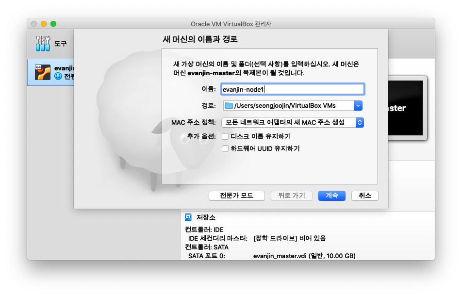

클릭하시면 위와 같이 나오게 창이 나오게 됩니다.
MAC주소 정책을 모든 네트워크 어댑터의 새 MAC 주소 생성으로 선택해주시고 계속을 클릭해주시면 됩니다.

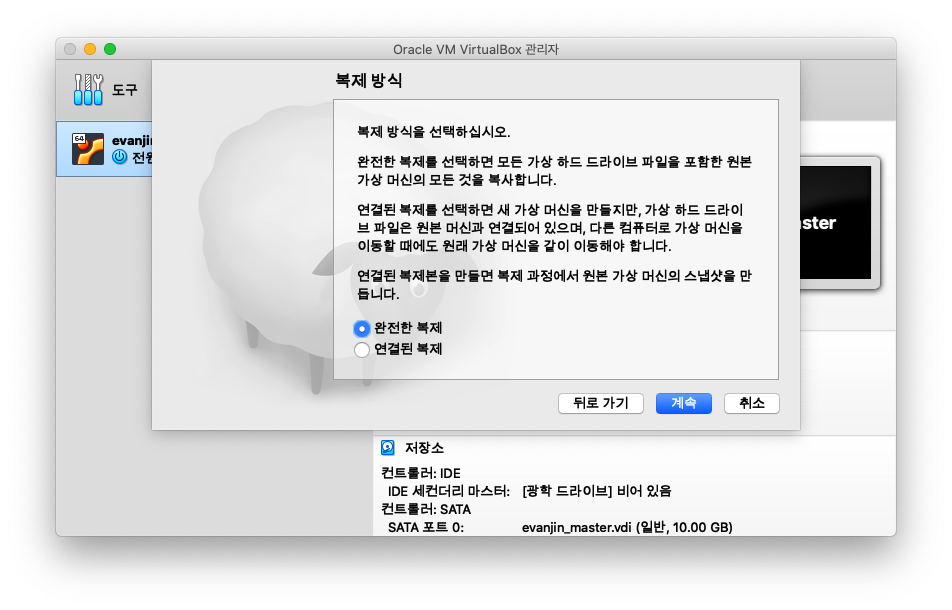

복제 방식을 선택하라고 나오게 되는데요 완전한 복제를 해줍니다.

복제된 워커 노드의 ip와 hostname을 변경해줍니다.

먼저 hostname을 변경해줍니다.

```shell
hostnamectl set-hostname evanjin-node1
```

다음으로 ip를 변경하여줍니다.
`/etc/network/interfaces`에서 address 부분만 `192.168.0.11`로 변경해줍니다.

만약 우분투 Lts 18이상이시라면 `/etc/netplan/50-cloud-init.yaml`에서 address 부분만 `192.168.0.11/24`로 변경해줍니다.

재부팅 후 ip와 hostname이 제대로 변경되었는지 아래 명령어를 통해서 확인해줍니다.

```shell
$ hostname

$ ifconfig
```

워커 노드2도 위와 동일하게 진행하며 hostname은 `evanjin-node2`로 해주고 address는 `192.168.0.12`로 해주시면 됩니다.
hostname는 제가 임의로 정한 것이므로 위에서 마스터 노드에서 정한 host들의 이름대로 해주시면 됩니다.

## 9. master 노드 설정

```shell
$ sudo kubeadm init --pod-network-cidr=10.244.0.0/16 --apiserver-advertise-address=192.168.0.10
```

위의 명령어가 제대로 실행되게 되면 아래와 같이 나오게 됩니다.

```shell
Your Kubernetes control-plane has initialized successfully!

To start using your cluster, you need to run the following as a regular user:

  mkdir -p $HOME/.kube
  sudo cp -i /etc/kubernetes/admin.conf $HOME/.kube/config
  sudo chown $(id -u):$(id -g) $HOME/.kube/config

You should now deploy a pod network to the cluster.
Run "kubectl apply -f [podnetwork].yaml" with one of the options listed at:
  https://kubernetes.io/docs/concepts/cluster-administration/addons/

Then you can join any number of worker nodes by running the following on each as root:

kubeadm join 192.168.0.10:6443 --token ix2ak9.nkg5p2smfkdke7hu \
    --discovery-token-ca-cert-hash sha256:cc1138bbb9a51bfaaf268a217fc55adeb1e49b38f2d0ae449009cd2716047324
```

kubeadm join부터 나오는 내용은 별도로 따로 복사해서 저장해둡니다.

다음으로 root 계정을 이용해서 kubectl을 실행할 수 있도록 환경변수를 설정해줍니다.

```shell
$ mkdir -p $HOME/.kube
$ sudo cp -i /etc/kubernetes/admin.conf $HOME/.kube/config
$ sudo chown $(id -u):$(id -g) $HOME/.kube/config
```

## 10. 워커 노드 설정

워커 노드에서는 위에서 kubeadm join부터 나왔던 내용을 그대로 복사해서 붙여넣고 실행해줍니다.

```shell
$ sudo kubeadm join 192.168.0.10:6443 --token ix2ak9.nkg5p2smfkdke7hu \
    --discovery-token-ca-cert-hash sha256:cc1138bbb9a51bfaaf268a217fc55adeb1e49b38f2d0ae449009cd2716047324
```

워커 노드들에 위의 명령어를 제대로 실행되었다면 마스터 노드에서 아래의 명령을 실행하면 추가된 워커 노드가 보이게됩니다.

```shell
$ kubectl get nodes
```

```shell
NAME             STATUS     ROLES    AGE   VERSION
evanjin-master   NotReady   master   14m   v1.17.0
evanjin-node1    NotReady   <none>   68s   v1.17.0
evanjin-node2    NotReady   <none>   47s   v1.17.0
```

## 11. Dashboard 설치

이 파트는 부가적인 부분으로 필요한 분만 설치하시면 됩니다.

kubernetes에서는 자체적인 Dashboard를 제공합니다.
kubernetes의 전반적인 상태를 UI로 보기 쉽게 제공합니다.

마스터 노드에서 아래의 명령어를 실행해줍니다.

```shell
$ sudo kubectl apply -f https://raw.githubusercontent.com/kubetm/kubetm.github.io/master/sample/practice/appendix/gcp-kubernetes-dashboard.yaml

```

다음으로 백그라운드에서 Proxy로 Dashboard를 띄우도록 하겠습니다.

```shell
$ sudo nohup kubectl proxy --port=8443 --address=192.168.0.10 --accept-hosts='^*$' >/dev/null 2>&1 &
```

```
http://192.168.0.10:8443/api/v1/namespaces/kube-system/services/https:kubernetes-dashboard:/proxy/.
```

만약 로그인 페이지에서 skip으로 접속 안 될시에는 아래 명령어로 토큰 확인 후 접근하시면 됩니다.

```shell
$ sudo kubectl -n kubernetes-dashboard describe secret $(kubectl -n kubernetes-dashboard get secret | grep admin-user | awk '{print $1}')
```

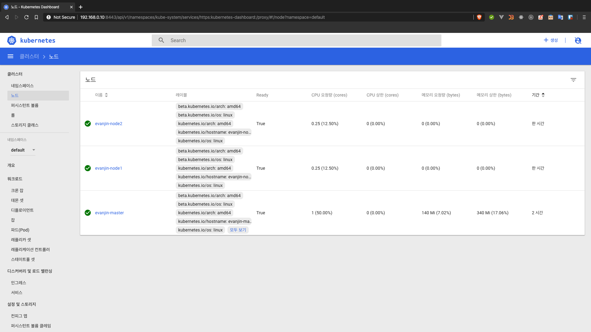

대시보드에서 노드가 우리가 설정한대로 master노드 하나와 worker노드 두개가 생성되었음을 보실 수 있습니다.
