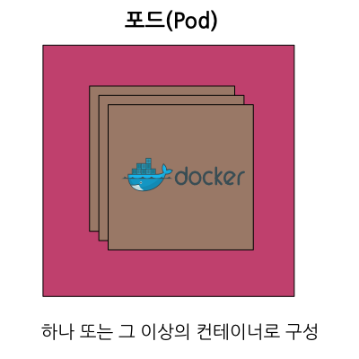
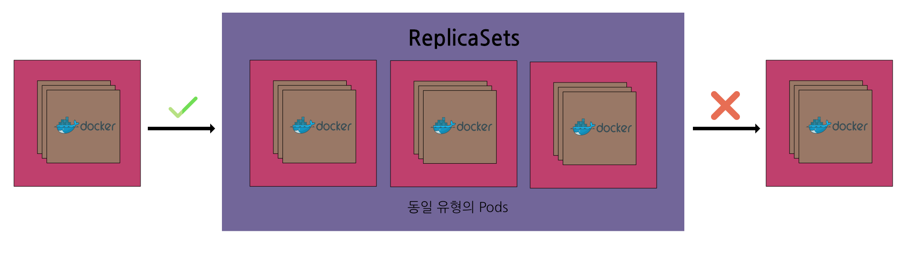
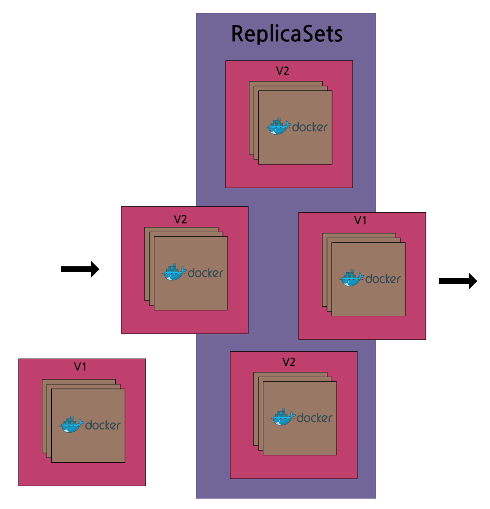

### Pods

- Pods는 Kubernetes 내부에서 컨테이너를 운영하는 기본 단위
- Pod는 환경 변수를 설정하고, 스토리지를 마운트(mount)하고, 기타 정보를 컨테이너에 피드(feet)하는 방법을 제공
- Kubernetes에서 Pods는 컨테이너의 작동을 담당
- 모든 Pod는 하나 이상의 컨테이너를 보유하고 해당 컨테이너의 실행을 제어
- 컨테이너의 수명이 다하면 Pod의 수명도 끝남

### ReplicaSets

- ReplicaSets는 Kubernetes에서 **하위 레벨** 유형으로 간주
- Kubernetes 사용자는 배포 및 DeamonSets와 같은 상위 레벨 추상화를 선택하는 경우가 많음
- ReplicaSet는 동일하게 구성된 Pod 세트들이 원하는 갯수의 복제본에서 실행되도록 함
- 하나의 Pod가 사라지면, ReplicaSet는 대체할 새로운 Pod를 온라인에서 가져옴

### Secrets

- Secrets는 base 64 인코딩되어 '움직임이 없는 상태'로 되어있지만 데이터가 Pod에 첨부될 때 자동으로 디코딩 됨
- Secrets는 파일 또는 환경 변수로 첨부될 수 있음
- 추가적인 암호화 기능을 사용하여 데이터 잠금을 통해 데이터를 보호함
- Secrets는 토큰, 인증서 또는 패스워드와 같이 공개되어서는 안되는 정보를 저장하기 위해 사용됨
- 민감한 구성데이터를 클러스터에 안전하게 저장할 수 있도록 Secrets은 런타임에서 Pods에 첨부될 수 있음

### Deployments

- Deployments는 롤링 업데이트 및 롤백을 지원함
- 롤아웃은 일시 중지될 수 있음
- Deployment는 일련의 Pods를 배포하고 유지 관리를 제어하는 고차원의 추상화
- 배후에서는 ReplicaSet를 사용하여 Pods를 계속 실행하지만, 클러스터 내에서는 일련의 Pods를 배포하고 업데이트하며 확장할 수 있는 정교한 로직을 제공함

### DaemonSets

- DaemonSets에는 많은 용도가 있음
- 자주 쓰는 용도 중 하나는 DeamonSets을 사용하여 각 호스트 노드(node)에 소프트웨어를 설치하거나 구성하는 것임
- DaemonSet는 클러스터의 모든 노드에서 Pod 복사본이 실행될 수 있게 함
- 클러스터의 확장과 축소에 따라, DaemonSet은 이러한 특수 레이블의 Pods를 모든 노드에 걸쳐 분산시킴

### Ingresses

- 클러스터 간에 트래픽을 라우팅
- 여러 애플리케이션에 대해 단일 SSL 엔드포인트를 제공
- Ingress는 매우 다양한 형태로 실행되기 때문에 플랫폼에 적합하도록 맞춤형으로 지원 가능함
- Ingresses는 트래픽을 클러스터 외부에서 클러스터 내의 여러 목표 지점으로 보내는 확실한 방법을 제공함
- 단 하나의 외부 Ingress 포인트 하나가 종류가 다른 많은 내부 서비스를 대상으로 하는 트래픽을 가능하게 함

### CronJobs

- 일반적인 Cron 신택스(syntax)를 사용하여 작업에 대한 스케줄링을 진행함
- CronJobs는 짧은 수명의 비 서비스(non-server)용 도구를 만들기 위한 Batch API의 일부임
- CronJobs은 Pods의 실행 일정을 수립하는 방법을 제공함
- 백업, 보고서 및 자동화된 테스트와 같은 정기적인 작업을 실행하는데 탁월함

### CRDs

- CRD는 새로운 리소스 유형을 정의하고 Kubernetes에게 이를 통보함
- 새 리소스 유형이 추가되면 해당 리소스의 새로운 인스턴스가 생성될 수 있음
- 일반적인 패턴은 새 CRD 인스턴스를 모니터링하여 그에 따라 반응하는 사용자 맞춤형 컨트롤러를 만드는 것임
- CustromResourceDefinitions(또는 CRDs)는 클러스터 운영자들과 개발자들이 그들만의 리소스 유형을 생성하는데 사용핧 수 있도록 확장 메커니즘을 제공함
