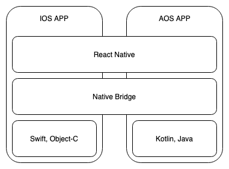
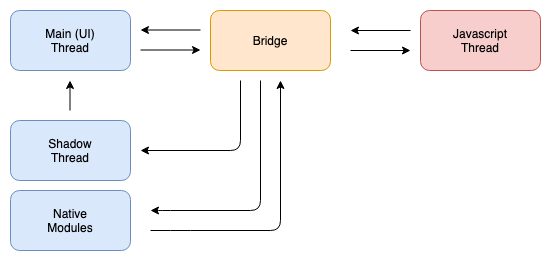
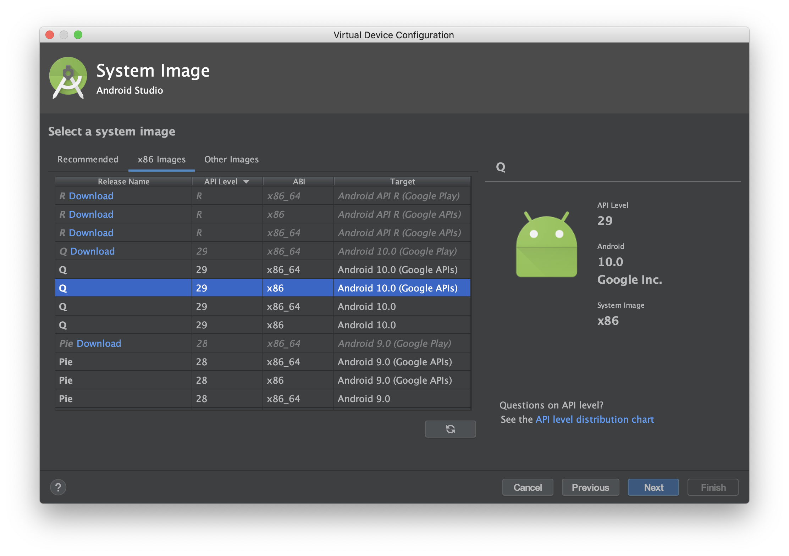
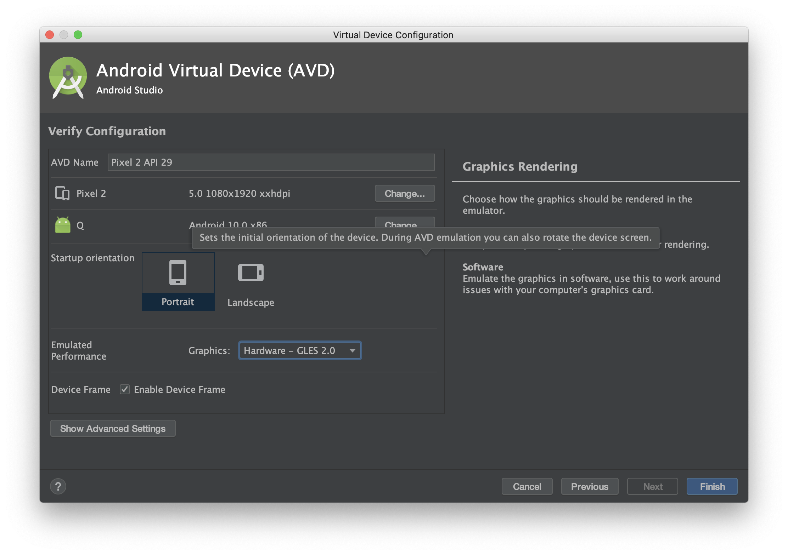
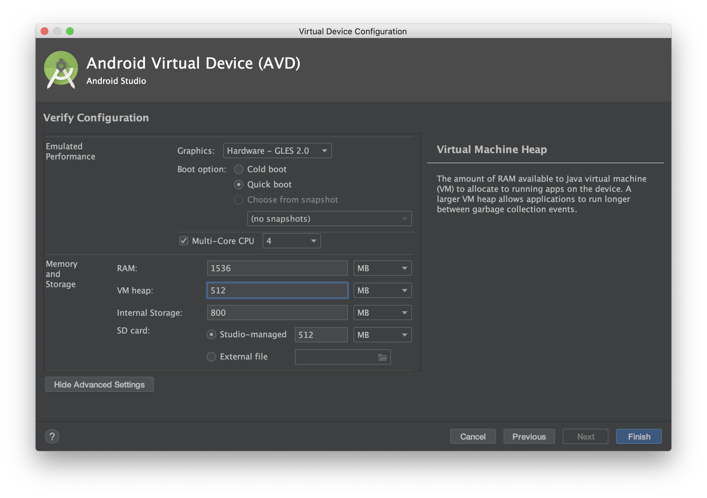

## React Native 이론



- 리액트 네이티브는 기존에 있던 하이브리드 웹앱의 성능 문제를 해결하기 위해서 웹브라우저(Web View)가 아닌 네이티브 브릿지(Native Bridge)를 사용합니다.
- 리액트 네이티브(자바스크립트)가 구동되는 자바스크립트 스레드(Javascript Thread)는 네이티브 브릿지를 통해 네이티브 스레드(Native Thread)와 통신하면서 기존 하이브리드 웹앱에 비해 성능을 최적화 시킵니다.
- 메트로는 자바스크립트 번들러로써 웹팩과 같은 역할을 합니다.

- React애서 가상돔을 통하여서 웹 브라우저의 DOM을 랜더링 하였다면 React Native에서는 네이티브 뷰를 렌더링 되도록 대상을 전환합니다.



- 화면 UI와 터치 인터렉션을 처리하는 UI Main 쓰레드와 자바스크립트로 작성한 비즈니스 로직을 실행하는 자바스크립트 쓰레드가 핵심적인 부분 입니다.
- 자바스크립트 쓰레드는 Webkit 기반의 자바스크립트 코어 엔진을 사용하고 ios는 os에 내장된 라이브러리를 사용하고 안드로이드는 라이브러리를 포함시켜 앱과 함께 빌드됩니다.
- 각 쓰레드는 독립적으로 실행되고 직접적인 통신은 할 수 없고 브릿지를 통해서만 통신할 수 있음
- 쉐도우 쓰레드는 레이아웃의 크키와 위치를 계산하는 역할을 합니다.
- 네이티브 모듈들이 사용하는 쓰레드도 존재합니다.

## 브릿지 특징

- 네이티브 메소드를 동기적으로 호출하면 싱글 쓰레드인 자바스크립트 쓰레드는 호출이 완료될 때까지 다른 코드의 실행이 중지됩니다.
- 비동기로 호출할 경우 기존 코드는 계속 수행되고 네이티브 작업이 완료되는 시점에 콜백 함수가 실행됩니다. (자바스크립트 쓰레드가 바쁜 상태라면 콜백함수의 실행도 지연)
- Native와 Javascript 두 영역이 성능상 이점으로 메모리를 공유하며 직렬화된 데이터를 교환하여 관리 이슈를 제거하였고 복사과정으로 인한 성능 저하는 발생합니다
- 빈번한 Native 호출이 발생하는 경우 부하 이슈가 발생하는데 이 부분은 호출을 큐에 넣은 후 5ms마다 일괄적으로 처리하는 방식으로 성능 개선을 하였습니다.

## React Native 폴더 및 파일 구조 설명

`android/app/build.gradle` : 안드로이드 앱을 빌드, 배포할 때 사용하는 파일

`android/app/src/main/java/com/[프로젝트 이름]/MainActivity.java, MainApplication.java` : 안드로이드 앱의 메인 파일

`android/app/src/main/res` : 안드로이드 앱의 아이콘 또는 시작 화면 등의 리소스를 관리하는 폴더

`ios/[프로젝트 명]/AppDelegate.h, AppDelegate.m` : ios 앱의 메인 파일들

`ios/[프로젝트 명]/Info.plist` : ios 프로젝트 설정파일

`ios/[프로젝트 명].xcworkspace` : ios 프로젝트를 Xcode로 시작하기 위한 파일

`ios/Podfile` : 코코아포드(ios의 의존성 관리자)의 의존성 관리 파일

## React Native 안드로이드 타켓 버전 확인

`android/build.gradle` 에서 `minSdkVersion` 와 `compileSdkVersion`, `targetSdkVersion` 으로 확인 가능합니다.

`minSdkVersion`는 안드로이드 디펜던시(패키지)에 따라서 올리기도 한다고 합니다.

또한, 앱 사용자 타겟을 Android 6.0 미만으로 두지 않을거라면 minSdkVersion을 6.0으로 올리는 것은 문제가 될거 같지 않다고 하는 커뮤니티 분들의 답변을 받아서
6.0으로 지정해도 무방하다면 올려도 나쁘진 않을거 같습니다.

## metro 설정

https://facebook.github.io/metro/docs/configuration

기본적인 설정인 `experimentalImportSupport : false`는 `const a = import("asdf");` 같은 실험적인 임포트 문법을 허용하지 않는 것이고
`inlineRequires : false`은 require으로 export된 모듈을 부를때 인라인에서 호출 가능한 옵션입니다.

Metro는 React Native를 위한 자바스크립트 번들러로써 jsx 문법을 js로 번들링 해주고 에셋들이 제대로 인식될 수 있도록 도와주는 역할을 하고 있습니다.

## 웹뷰 사용하기

https://medium.com/@sw.lee/reactnative-webview-f7759d06ea3b

https://medium.com/capriza-engineering/communicating-between-react-native-and-the-webview-ac14b8b8b91a

- 안드로이드 경우 쿠키를 받으려면 보내는쪽에서 setTimeOut을 줘야 받을 수 있습니다.
- postMessage : iframe이랑 주고받던 postMessage를 RN WebView 컴포넌트에 props 형태로 만들어 놓은 것입니다.

## 효율적인 작업순서

ios에서 기본적인 작업 (레이아웃, 데이터 연동) -> aos에서 복잡한 애니메이션&인터렉션 확인 -> ios에 특화된 ux작업

## Async Storage

iOS 및 Android의 다양한 기본 스토리지 유형에 의해 지원되는 React Native의 기능입니다.
AOS/IOS 둘 다 해당 스마트폰 저장공간(앱의 로컬 디비)에 저장되게 됩니다.
다른 앱에서 억세스할 수 없으며 앱에 바인딩 되어있고 앱을 삭제하는 경우 같이 삭제되게 됩니다.

사용방법 : https://github.com/react-native-community/async-storage/blob/master/packages/core/docs/API.md

보통 jwt 토큰을 Async Storage에 많이 저장하여서 사용하고 있습니다.

## React Navigation 간단 정리

### Stack Navigation

- 한 화면 위에 다른 화면을 쌓아 올리듯 화면을 전환하는 네비게이션

https://reactnavigation.org/docs/stack-navigator

- 웹에서 화면을 가득 채우는 모달을 위의 네비게이션으로 가능합니다.

https://reactnavigation.org/docs/modal

### Drawer Navigation

- 주로 메뉴에 사용되는 네비게이션으로 사용자의 스와이프 액션에 반응하여 화면에 표시되는 네비게이션

https://reactnavigation.org/docs/drawer-navigator

### Bottom Tab Navigator

- 화면 하단에서 Tab으로 화면을 전환하는 네비게이션

https://reactnavigation.org/docs/bottom-tab-navigator

### Material Bottom Tab Navigation

- Bottom Tab Navigator과 동일하게 화면 하단에서 Tab으로 화면 전환하는 네비게이션이며 Google의 Material 디자인이 적용된 네비게이션

https://reactnavigation.org/docs/material-bottom-tab-navigator

### Material Top Tab Navigation

- Google의 Material 디자인이 적응된 네비게이션으로써 화면 상단에서 Tab으로 화면을 전환하는 네비게이션

https://reactnavigation.org/docs/material-top-tab-navigator

### 로그인 여부에 따른 네비게이션 처리

https://reactnavigation.org/docs/auth-flow

### 안드로이드 물리적 뒤로가기 버튼 처리

https://reactnavigation.org/docs/custom-android-back-button-handling

아이폰의 백스와이프는 따로 처리할 수 없습니다.

### 네비게이션의 상태 reset

https://reactnavigation.org/docs/navigation-prop#reset

## 초기 환경설정(Mac)

### 공통 설정 (Mac)

node & watchman 설치

```bash
$ brew install node
$ brew install watchman
```

### ios 설정

Xcode 설치 후 Preferences => Locations 에서 Command Line Tools에서 선택하여 설정

CocoaPods 설치

```bash
sudo gem install cocoapods
```

### 안드로이드 설정

Java 설치

https://adoptopenjdk.net/

위에 사이트에서 adoptopenjdk8를 설치해줍니다.

안드로이드 스튜디오 설치시 Custom으로 설정하여 아래의 설정을 해주어야 합니다.

- Android SDK
- Android SDK Platform
- Performance (Intel ® HAXM) ( [See here for AMD](https://android-developers.googleblog.com/2018/07/android-emulator-amd-processor-hyper-v.html) )

### 안드로이드 SDK 설치

**Appearance & Behavior** → **System Settings** → **Android SDK**

에서 설치 가능합니다.

android 9 (Pie), Android SDK Platform 28, Intel x86 Atom_64 System Image, Google APIs Intel x86 Atom System Image를 체크 박스 하여 적용하고 설치합니다

```bash
export ANDROID_HOME=$HOME/Library/Android/sdk
export PATH=$PATH:$ANDROID_HOME/emulator
export PATH=$PATH:$ANDROID_HOME/tools
export PATH=$PATH:$ANDROID_HOME/tools/bin
export PATH=$PATH:$ANDROID_HOME/platform-tools
```

위의 설정을 `~/.zshrc` 에 저장하여 줍니다.

## 절대 경로 사용

https://www.npmjs.com/package/babel-plugin-root-import

## 안드로이드 에뮬 생성 팁

기기 선택 후
시스템 이미지 선택시 Google APIs에 x86인 것을 고릅니다.



다음으로 에뮬 설정에서 퍼포먼스에서 Hardware - GLES 2.0을 선택해줍니다.



다음으로 Show Advanced Settings를 눌러줍니다.
VM Heap 을 512로 설정해줍니다.



## Firebase Cloud Messaging 간단 정리

### HTTP v1 메세지 형태 (서버에서 보내는 json 형태)

일반적인 알림 (제목과 내용만 있는 알림)

```json
"message":{
        "token" : "bk3RNwTe3H0:CI2k_HHwgIpoDKCIZvvDMExUdFQ3P1...",
            "notification":{
                  "title" : "안녕",
                  "body" : "안녕하세요",
        }
}
```

이미지 포함된 알림 (해당 이미지는 안드로이드에서만 사용되게 되며 Large icon과 메시지를 아래로 펼쳤을때 이미지로 사용되게 됩니다.)

```json
"message":{
        "token" : "bk3RNwTe3H0:CI2k_HHwgIpoDKCIZvvDMExUdFQ3P1...",
          "notification":{
               "title" : "안녕",
               "body" : "안녕하세요",
                "image" :  "https://blabla.com/image.png"
        }
}
```

AOS 및 apns(IOS) 추가 설정하기

```json
"message":{
        "token" : "bk3RNwTe3H0:CI2k_HHwgIpoDKCIZvvDMExUdFQ3P1...",
         "notification":{
               "title" : "스토리잼",
               "body" : "스토리잼에 오신걸 환영합니다.",
                "image" :  "https://blabla.com/image.png"
        }
        "android":  {
            "notification": {
                "default_sound": false
            }
        },
        "apns": {
            "payload": {
                  "badge": 1,
                   "sound": "bingbong.aiff"
              }
        }
}
```

AOS에서는 제목, 내용, 채널아이디, 알림의 진동, 소리, 빛 등을 설정할 수 있으며 더 많은 옵션은 아래를 통해서 확인하실 수 있습니다.

https://firebase.google.com/docs/reference/fcm/rest/v1/projects.messages?hl=ko#Notification

IOS에서도 payload안에서 옵션을 바꾸어서 알림 제목, 내용을 바꿀 수 있고 알림의 소리와 배지 갯수를 설정할 수 있습니다. 더 많은 옵션은 아래 링크를 통해서 확인할 수 있습니다.

https://developer.apple.com/documentation/usernotifications/setting_up_a_remote_notification_server/generating_a_remote_notification

### React Native에서 알림에 대한 설정

기본적으로 AOS에서는 여러가지 것들은 알림에서 지정해줄 수 있습니다. (React Native에서 설정 가능)

https://rnfirebase.io/docs/v5.x.x/notifications/reference/AndroidNotification

IOS도 여러 옵션을 가지고 있습니다. (React Native에서 설정 가능)

https://rnfirebase.io/docs/v5.x.x/notifications/reference/IOSNotification

### IOS 푸시 설정

아래글을 참고하여 apn 인증서 추가합니다.

https://firebase.google.com/docs/cloud-messaging/ios/certs

다음으로 프로젝트 폴더에서 `[앱이름].xcworkspace`를 눌러서 Xcode를 실행시켜주고 `Signing & Capabliities`탭에서 바로 아래 `+ Capabliities` 눌러서 추가 설정합니다.

push를 검색하여 `Push Notification`을 추가해줍니다.

추가로 `Background Modes`를 검색해서 추가하고 `Remote notification`을 선택해줍니다.

## 참고하면 좋은 글들

- 글로벌 : https://www.notion.so/24434e28291049359918441c582ac4bb
- RN 가볍게 만들기 1 : https://www.notion.so/RN-1-589cbbdfa4d14958b1a629024eb7d3ae
- RN 가볍게 만들기 2 : https://www.notion.so/RN-2-3d1291440b0447acaf967705d23501d8

## 참고로 알아두면 좋은 라이브러리

- 앱 버전 체크 : https://github.com/kimxogus/react-native-version-check
- 기기 정보 가져오기 : https://github.com/react-native-community/react-native-device-info
- 네트워크 정보 가져오기 : https://github.com/react-native-community/react-native-netinfo
- 별점 리뷰 유도 : https://github.com/KjellConnelly/react-native-rate
- 애플 로그인 : https://github.com/invertase/react-native-apple-authentication
- Fast Image : https://github.com/DylanVann/react-native-fast-image
- 이미지를 골라서 crop할 수 있는 라이브러리 : https://github.com/ivpusic/react-native-image-crop-picker
- 기존의 애니메이션 라이브러리보다 기능이 많은 라이브러리 : https://github.com/software-mansion/react-native-reanimated
- swiper : https://github.com/leecade/react-native-swiper
- Swiper/carousel : https://github.com/archriss/react-native-snap-carousel
- ios input에 입력시 키보드가 입력창에 맞게 올라오도록 해주는 라이브러리 : https://github.com/Andr3wHur5t/react-native-keyboard-spacer
