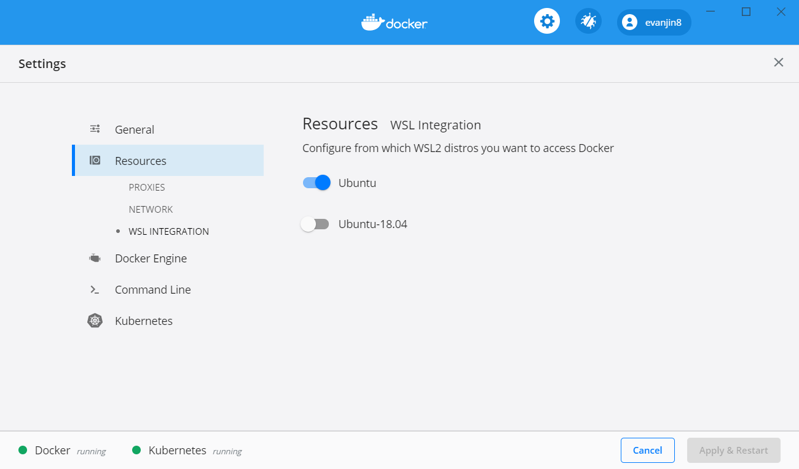

### 0. wsl2 설치

```powershell
dism.exe /online /enable-feature /featurename:Microsoft-Windows-Subsystem-Linux /all /norestart
dism.exe /online /enable-feature /featurename:VirtualMachinePlatform /all /norestart
```

먼저 powershell를 통해서 inux 용 Windows 하위 시스템 및 가상 컴퓨터 플랫폼 선택적 구성 요소를 설치해줍니다.
설치 후 재부팅을 진행하여 줍니다.

https://docs.microsoft.com/ko-kr/windows/wsl/install-win10#windows-10-fall-creators-update-and-later-install-from-the-microsoft-store

설치 후 리부팅을 하였다면 위의 링크의 가이드대로 window store에서 로그인 후 리눅스를 설치해줍니다.
저는 개인적으로 ubnntu이 편해서 ubuntu 18.04 lts로 설치해주었습니다.
설치 후 재부팅 하여줍니다.

설치 이후에 PowerShell에서 wsl명령을 실행하면 wsl에 접속할 수 있게 됩니다.

추가적으로 vscode를 쓰시는 분들은 아래 확장을 추가해주시면 wsl를 사용하기 편리하십니다.

https://marketplace.visualstudio.com/items?itemName=ms-vscode-remote.remote-wsl

다음으로 window 참가자 프로그램을 설정해주어야합니다.

https://www.microsoft.com/en-us/software-download/windowsinsiderpreviewiso?wa=wsignin1.0

위 링크를 참고하여서 설치해주시면 됩니다.

```powershell
$ wsl -l -v
  NAME                   STATE           VERSION
* Ubuntu-18.04           Stopped         1
  docker-desktop-data    Running         2
  docker-desktop         Running         2

$ wsl --set-version Ubuntu-18.04 2
```

설치 후에 위와 같이 Powershell에서 위와같이 설정해줍니다.
저는 Ubuntu-18.04를 설치하여서 위와 같이 진행하였습니다.

### 1. docker 및 kubernetes 설치

https://docs.docker.com/docker-for-windows/wsl-tech-preview/

위의 링크를 참고하여 윈도우용 docker desktop을 설치 후
General에서 Enable the experimental WSL 2 based engine를 체크하여주고
Resources > WSL Integration에서 설치한 리눅스 버전을 체크해주시면 됩니다.




위와 같이 설정 후 재부팅 후에 Powershell에서 wsl로 실행해주고
docker를 실행해주시면 이상없이 실행된다면 정상적으로 설치된 것입니다.

```bash
$ sudo docker run hello-world
```

혹시 모르니 위의 명령도 실행해봅니다.

```bash
Hello from Docker!
This message shows that your installation appears to be working correctly.
```

실행시 위와 같은 메세지가 뜬다면 이상 없이 docker가 작동하는 것입니다.


kubernetes도 동일하게 위와 같이 설정해줍니다.

```bash
$ kubectl version
Client Version: version.Info{Major:"1", Minor:"15", GitVersion:"v1.15.5", GitCommit:"20c265fef0741dd71a66480e35bd69f18351daea", GitTreeState:"clean", BuildDate:"2019-10-15T19:16:51Z", GoVersion:"go1.12.10", Compiler:"gc", Platform:"linux/amd64"}
Server Version: version.Info{Major:"1", Minor:"15", GitVersion:"v1.15.5", GitCommit:"20c265fef0741dd71a66480e35bd69f18351daea", GitTreeState:"clean", BuildDate:"2019-10-15T19:07:57Z", GoVersion:"go1.12.10", Compiler:"gc", Platform:"linux/amd64"}
```

wsl에서 위의 명령을 쳐보니 kubectl는 정상적으로 작동함을 볼 수 있으실 것입니다.

### 2. wordpress로 테스트해보기

https://evanjin.dev/development/k8s-wordpress/#1-secret-%EC%83%9D%EC%84%B1

전에 포스팅한 글대로 한번 설치해보도록 하겠습니다.

워드프레스를 실행하실 때 wsl의 ip를 확인하여야합니다.

```bash
$ ip addr show eth0
5: eth0: <BROADCAST,MULTICAST,UP,LOWER_UP> mtu 1500 qdisc mq state UP group default qlen 1000
    link/ether 00:15:5d:97:94:f8 brd ff:ff:ff:ff:ff:ff
    inet 172.19.187.181/20 brd 172.19.191.255 scope global eth0
       valid_lft forever preferred_lft forever
    inet6 fe80::215:5dff:fe97:94f8/64 scope link
       valid_lft forever preferred_lft forever

$ kubectl get service
NAME         TYPE        CLUSTER-IP      EXTERNAL-IP   PORT(S)        AGE
kubernetes   ClusterIP   10.96.0.1       <none>        443/TCP        142m
mysql        ClusterIP   10.103.1.80     <none>        3306/TCP       7m22s
wordpress    NodePort    10.107.164.53   <none>        80:30180/TCP   2m17s
```

`http://(wsl ip):30180`으로 접속하면 워드프레스가 실행됨을 보실 수 있습니다.


