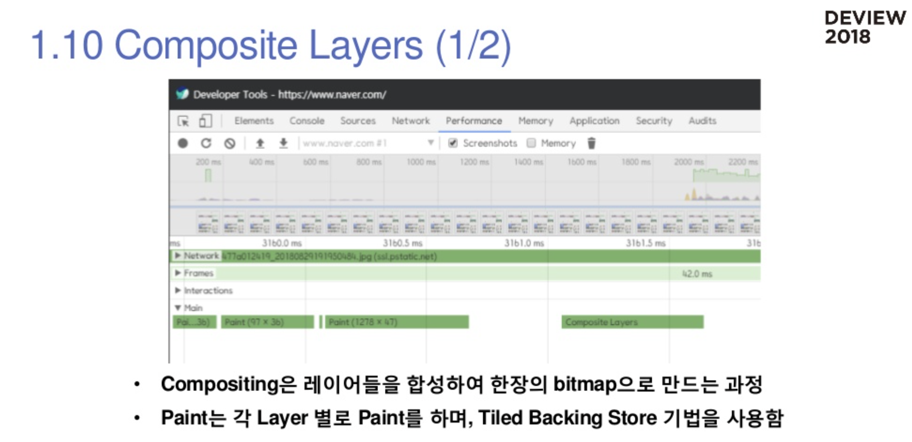
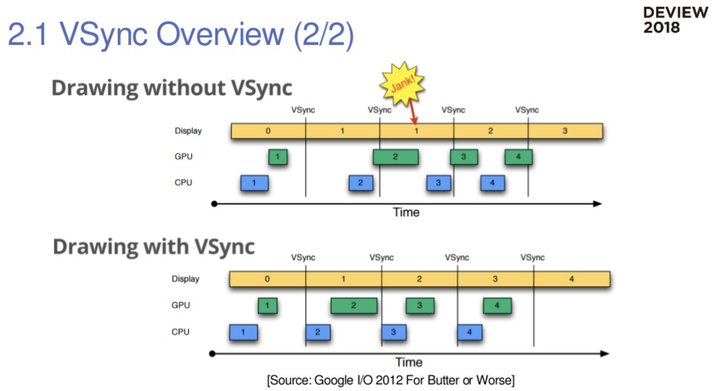
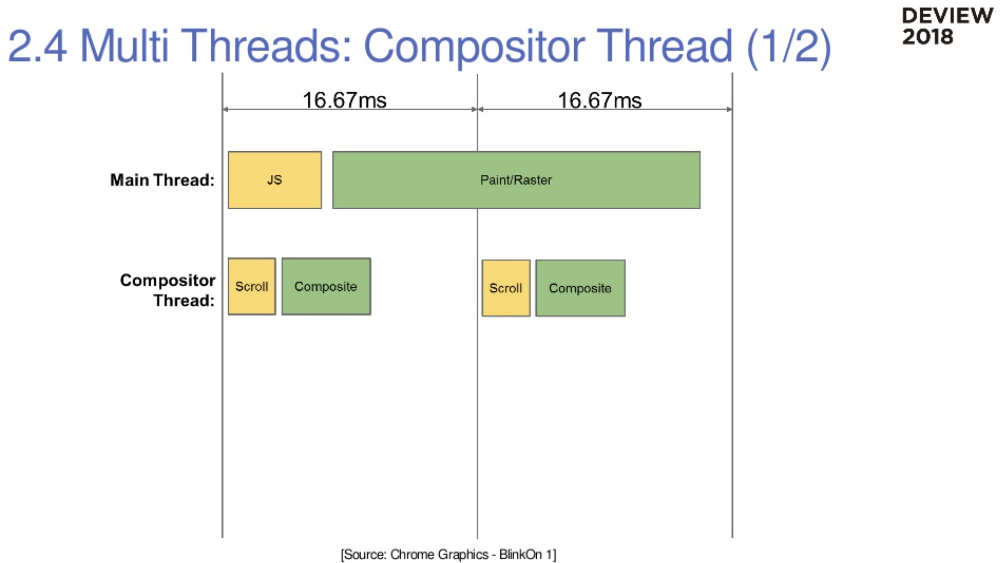

# Summary of browsers main flows

## HTML Parsing

HTML을 paser해서 DOM Tree를 만드는 과정

돔트리는 사용하는 document를 쉽게 가공하기 위해서 트리를 만들어서 사용하고 있음.

돔트리를 만드는 과정을 좀 더 자세하게 설명해놓은 장표

브라우저는 html을 한번에 처리하지 않고 오는대로 조금씩 처리해서 돔트리를 만들고 있음.

html5시대에는 톰트리 모양이 거의 다 동일함.

## Javascript Engine

일반적으로 자바스크립트는 여러가지 다양한 경로로 실행함.

Javscript Core를 분석에서 만드신 것.

일반적으로 v8은 js를 받아서 jit 컴파일을 통해서 바로 머신코드를 생성함.

웹킷 계열은 js를 파싱해서 바이트코드를 만들어서 인터프리터가 중앙에 있어서 바이트 코드가 실행됨.

jit의 장점은 속도가 빠름. 단점은 컴파일 시간이 오래걸리고 메모리를 많이 먹음.

v8도 2017년에 이그니션이라는 인터프리터를 도입함.

[https://v8.dev/docs/ignition](https://v8.dev/docs/ignition)

인터프리터가 v8로 도입되면서 js코드를 받으면 먼저 인터프리터가 바이트코드를 만들고 만들어진 바이트코드를 실행하거나 최적화를 해서 jit해서 하는 플로우가 완성됨.

V8과 JSC가 동일한 동작.

## Recalculate Style

**Parsing된 CSS결과(CSSOM)를 Render Tree에 적용하는 과정**

- HTML은 단순 문서, 각 엘리먼트들의 렌더링에 관한 모든 정보는 CSS가 가지고 있음.
- CSS Parsing 과정은 Dev Tools에는 표시 되지 않음.

## Render Tree

HTML HEAD 등은 Render Tree에 포함되지 않음.

웹 퍼포먼스가 렌더 트리에는 없음 ⇒ css에서 display: none을 하였기 때문에.

## Layout

Render Tree 노드(Box)들의 좌표를 계산하는 과정

- CSS 2.1 Box Model, Visual formatting model을 기반
- 박스의 크기와 위치를 계산하는 과정
- Global and incremental layout

브라우저의 모든 렌더링 엘리먼트는 박스형태로 되어 있고

대표적으로 박스는 block형태와 inline형태가 있음.

레이아웃의 결과는 각 박스들의 크기와 위치, 높이임.

## Paint

계산된 좌표를 가지고 페인트를 하게 됨.

프린트임.

프린트처럼 한 픽셀이 한 픽셀씩 그리고 굉장히 느림.

## New version of browser's main flow

JS로 퉁치는 이유는 옛날 브라우저볼때의 관점은 로딩이 중심이였음.

요즘은 로딩보다는 로딩 이후의 과정이 중요함.

Recalc Style은 렌더트리를 만드는 과정

Layout : 좌표 계산

브라우저도 웹화면을 한장의 비트맵으로 처리하지 않고 포토샾처럼 레이러링을 해서 함.

레이어링을 하기 위한 것이 Update Layout Tree와 Composite임.

## Update Layer Tree

랜더링에 사용될 최종 Layer들을 계산 해서 생성 하는 과정

## Composite Layers

브라우저에서 한번에 비트맵을 다 그리지 않고 타일로 나눠서 그림. 타일로 나눠서 그리는 이유는 화면을  재사용하기 위해서임.

# How the browser makes a frame?

## VSync Overview

모니터에서 프레임을 fetch함.

Vsync 기반으로 렌더링함.

## How the browser makes a frame?

## Main Thread Rendering

기본적으로 브라우저의 모든 컨텐츠들은 메인 쓰레드에서만 처리함. (JS → Recalc Style → Layout → Update Layout Tree → Paint → Composite)

브라우저는 구조적으로 싱글 코어만 사용할 수 있는 디자인으로 설계됨.

브라우저의 모든 자료구조들이(돔트리, 렌더트리) 메인쓰레드에서만 동작을 해야됨.

첫 번째 이유가 html,js는 병렬로 처리할 수 없는 구조이기 때문임.

또한 컨텐츠가 자주 바꿔지고 돔트리나 렌더트리 갯수가 굉장히 많음. (몇천개 단위)

## Multi Threads: Compositor Thread

크로미움 오픈소스 기반인 것들은 이 문제를 해결함.

첫번째로 컴포지터를 분리함.

합성 과정은 복사해야할 자료구조가 많지 않음.

스크롤링을 컴포지터 쓰레드에서 처리할 수 있음.

## Multi Threads: Raster Threads

비트맵을 만드는 과정을 Raster라고 보면 됨.

skia는 안드로이드에서도 2d 그래픽 라이브러리로 사용하고 있고 크로미움에서도 사용하고 있음.

skia기능에는 모든 그래픽 커맨드들을 저장했다가 나중에 리플레이를 할 수 있는 기능이 있음.

이 기법을 크로미움 기반에서 사용하고 있음.

메인 쓰레드에서 페인트 과정은 해당 하는 커맨드를 레코딩만 하고 Raster Thread에서 리플레이하여 페인팅함.

Main Tread와 Compositor Thread, Raster Thread로 60fps를 맞추고 있음.

# VSync based browser processing

브라우저 프로세스가 있고 렌더러 프로세스가 있고 GPU 프로세스가  있음.

브라우저 프로세스는 UI를 담당 (사용자의 input을 받고 UI구성을 함)

렌더러 프로세스는 html파싱하고 라우팅하고 렌더링하는 모든 일들을 함. 렌더러 프로세스는 탭당 하나임.

브라우저 보안상 렌더러 프로세스는 샌드박스 되어 있음.

샌드박스로 되어있기 때문에 메모리와 cpu만 사용할 수 있음.

gpu자원은 렌더러에서 접근할 수 없기 때문에 gpu 프로세스를 통해서 화면을 렌더링 시킴.

input 주기와 VSync가 서로 다름.

가장 이상적인 모델은 VSync tick 전에 인풋을 먼저 받으면 input이 들어와서 js를 처리하고 레이아웃하고 페인팅하고 컴포지팅하게 되면 VSync tick에 화면을 렌더링 할 수 있음.

input이 VSync tick 후에 들어오게 되면 다음 VSync tick에 렌더링됨. (엇박자)

input이 들어오는 주기가 불규칙적이면 일정한 프레임을 못 찍기 때문에 브라우저에서는 VSync tick이 들어오고 처리하기 전에 input을 먼저 보내고 VSync tick을 처리함.

VSync tick이 발생했을 때 일들을 VSync tick 내에 처리해서 페인트를 하자는 컨셉.

2-3년 전에 애니메이션 만들 때 돔 타이머 vs rAF냐 논쟁이 있었음.

돔 타이머는 브라우저의 렌더링 사이클과 다르게 돔타이머 tick을 만들어서 돔을 수정한다면

rAF는 브라우저가 VSync tick이 발생하고 실제 좌표를 계산하기 전에 rAF콜백을 호출해주면 VSync tick에 딱 만들어짐 (브라우저 렌더링 사이클과 맞음)

돔타이머보다는 rAF를 사용하는게 VSync tick에 더 잘 맞을 수 있음.

VSync tick을 돌때 항상 바쁜 것은 아님.

16.67ms 안에 input과 render를 다 처리하면 GC를 돌리거나 Idle callback을 호출함.

Idle request callback이라는 것이 있음.

이벤트를 달아놓으면 브라우저가 VSync tick이 발생해서 할 일다하고 시간이 남을 때 Idle callback을 실행해줌.

[window.requestIdleCallback()](https://developer.mozilla.org/ko/docs/Web/API/Window/requestIdleCallback)

이런 콜백을 사용하면 렌더링 성능 저하 없이 브라우저가 노는 시간을 활용할 수 있음.

tracing에서 브라우저가 VSync 단위로 모든 과정들을 확인해볼 수 있음.

병목등을 데브툴보다 더 자세하게 확인할 수 있음.

# Rendering pipeline stage costs

[CSS Triggers](https://csstriggers.com/)

가장 비싼 파이프라인은 js를 수정하는 것.

가장 저렴한 파이프라인은 composite임.

viewport라는 메타태그를 명시하면 컨텐츠를 GPU를 통해서 그림.

정리한 영상 및 발표 자료

[웹 성능 최적화에 필요한 브라우저의 모든 것](https://tv.naver.com/v/4578425)

[웹 성능 최적화에 필요한 브라우저의 모든 것](https://www.slideshare.net/deview/125-119068291)