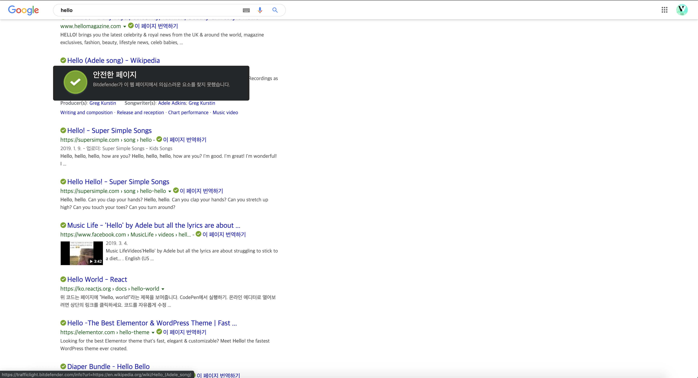

## 추천 크롬 확장프로그램

### [TrafficLight](https://chrome.google.com/webstore/detail/trafficlight/cfnpidifppmenkapgihekkeednfoenal/reviews?hl=ko)

TrafficLight는 백신을 만들어내는 업체인 Bitdefender에서 만든 크롬 확장프로그램입니다.
저는 주로 검색 후 안전한 사이트인지 확인하는 용도로 거의 쓰고 있습니다.

### [The Great Suspender](https://chrome.google.com/webstore/detail/the-great-suspender/klbibkeccnjlkjkiokjodocebajanakg)

The Great Suspender는 크롬 탭을 관리해주는 확장프로그램입니다.
크롬이 램을 많이 먹는 브라우저로 유명한 것은 다들 아실 겁니다.
물론 발전을 많이해서 최적화를 해주기는 하지만 그래도 쓰지 않는 탭을 죽이는 것이 최적의 방법이라고 생각합니다.
그 역할을 해주는 것이 해당 확장프로그램입니다.
기본 설정으로 1시간 동안 사용하지 않으면 탭을 비활성화 해줍니다.

### [Octotree](https://chrome.google.com/webstore/detail/octotree/bkhaagjahfmjljalopjnoealnfndnagc)

Octotree은 웹에 있는 깃허브의 레파지토리를 트리구조로 볼 수 있도록 도와줍니다.
보통 깃허브를 clone 받아서 해당 소스를 자세하게 보기도 하지만 웹에서 바로 보는 것이 사실 더 낫긴 하기 때문에
거의 저에겐 필수 확장프로그램입니다.

### [LastPass: Free Password Manager](https://chrome.google.com/webstore/detail/lastpass-free-password-ma/hdokiejnpimakedhajhdlcegeplioahd)

LastPass는 비밀번호 매니저 프로그램으로써 1password와 동일한 역할을 합니다.
url 기준으로 자동 채우기를 해주며 나 대신 어려운 암호를 만들어 기억해줍니다.

### [Vue.js devtools](https://chrome.google.com/webstore/detail/vuejs-devtools/nhdogjmejiglipccpnnnanhbledajbpd)

vue.js 개발자에게는 필수 확장프로그램입니다.
물론 사용하지 않아도 큰 무리는 없지만 vue에서 data 핸들링하는 히스토리와 vuex의 동작 등을 볼 수 있습니다.
또한, 사이트가 vue.js로 이루어져 있으면 표시해줍니다.

### [React Developer Tools](https://chrome.google.com/webstore/detail/vuejs-devtools/nhdogjmejiglipccpnnnanhbledajbpd)

react로 만들어진 컴포넌트 단위로 표현해줍니다.
이러한 컴포넌트의 props 등을 자세하게 표현해줍니다.
또한, 사이트가 리액트로 이루어져 있으면 표시해줍니다.

### [Redux DevTools](https://chrome.google.com/webstore/detail/redux-devtools/lmhkpmbekcpmknklioeibfkpmmfibljd)

redux의 변화를 정말 잘 보여주는 확장프로그램입니다.
airbnb사이트에서 해당 확장프로그램을 보면 대단한 확장 프로그램이라는 것을 느낄 수 있습니다.
redux의 구조, 변화 등을 정말 잘 표현해줍니다.

### [Wappalyzer](https://chrome.google.com/webstore/detail/wappalyzer/gppongmhjkpfnbhagpmjfkannfbllamg)

Wappalyzer는 웹사이트가 어떤 기술 스택을 사용하고 있는지 파악할 수 있게 해줍니다.
경쟁사 업체 사이트 파악이나 궁금한 사이트 스택 파악시 좋습니다.

### [Momentum](https://chrome.google.com/webstore/detail/momentum/laookkfknpbbblfpciffpaejjkokdgca?hl=ko)

Momentum은 저는 주로 이쁜 배경을 보려고 쓰긴 합니다.
새탭에 펼쳐지는 아름다운 자연 배경은 엄청나게 아름답습니다.

## 추천 맥 프로그램

### [Dato](https://apps.apple.com/us/app/dato/id1470584107?mt=12)

기본 날짜를 보여주는 것보다 자기의 입맛대로 커스텀할 수 있는 설정을 해줄 수 있습니다.
dark 모드도 지원해주고 제 입맛대로 볼 수 있어서 애용하는 프로그램입니다.

### [appcleaner](http://freemacsoft.net/appcleaner/)

맥에서 App Store에서 다운받은 앱을 삭제하긴 쉽지만 dmg으로 설치한 앱은 삭제하기 까다롭긴합니다.
이러한 부분은 이 앱은 도와줍니다.

### [Postman](https://www.getpostman.com/)

API을 테스트하는 툴입니다.
프론트에서 API 바로 테스트하기 않고 해당 앱으로 테스트하여 이상이 있거나 하면 백엔드 개발자에게 피드백을 줄 수 있습니다.

### [KeepingYouAwake](https://github.com/newmarcel/KeepingYouAwake)

해당 앱은 mac이 sleep mode에 빠지지 않도록 해줍니다.
caffeine이라는 앱이 가장 유명하지만 저는 이것을 사용하고 있습니다.

### [MindNode](https://apps.apple.com/app/mindnode-5/id1289197285?ign-mpt=uo%3D4&l=en&mt=12)

보통 저는 생각을 정리할 때 마인드맵을 사용합니다.
그때 사용하는 마인드맵 프로그램입니다.

### [Magnet](https://apps.apple.com/us/app/magnet/id441258766?mt=12)

맥에서 화면 분할 하기 까다로운 면이 있습니다.
이것을 해결해주는 맥 프로그램입니다.

### [PopClip](https://apps.apple.com/kr/app/popclip/id445189367?mt=12)

기본적인 기능을 마우스로 선택해서 복사 붙여넣기 하는 것입니다.
그 외에도 여러가지 기능을 가지고 있습니다.
아래의 확장 기능을 확인하셔서 필요한 기능을 사용하시면 됩니다.
https://pilotmoon.com/popclip/extensions/

### [Foldery](https://apps.apple.com/kr/app/foldery/id815333099?mt=12)

맥은 폴더 구분하기에는 이름 밖에 없기에 가끔 해깔립니다.
이 앱은 폴더의 색깔을 변경해서 구분할 수 있도록 해줍니다.

### [반디집: 압축 및 압축해제 프로그램](https://apps.apple.com/kr/app/%EB%B0%98%EB%94%94%EC%A7%91-%EC%95%95%EC%B6%95-%EB%B0%8F-%EC%95%95%EC%B6%95%ED%95%B4%EC%A0%9C-%ED%94%84%EB%A1%9C%EA%B7%B8%EB%9E%A8/id1265704574?mt=12)

기본 압축 프로그램으로 압축을 풀 때 제대로 되지 않을 때가 가끔 있습니다.
이러한 점을 반디집이 해결해주는 경우가 많습니다.

### [things3](https://culturedcode.com/things/)

여러 todo 앱 중에 완성도가 높은 편입니다.
사실 가격은 정말 사악한 편이고 맥과 ios에서만 사용할 수 있기 때문에 범용성을 포기해야 하는 면이 있긴 합니다.
그래도 사용한다보면 이 앱의 완성도 때문에 빠져들게 됩니다.

### [Bartender](https://www.macbartender.com/)

맥의 메뉴바를 정리해주는 앱니다.
비슷한 프로그램으로 [vanilla](https://matthewpalmer.net/vanilla/)이 있습니다.

### [iStat Menus](https://bjango.com/mac/istatmenus/)

맥 시스템을 모니터링 해주는 프로그램 중 가장 유명한 프로그램입니다.
비슷한 프로그램으로 [iGlance](https://github.com/iglance/iGlance)가 있습니다.

### [CleanMyMac](https://macpaw.com/cleanmymac)

맥의 시스템을 분석하고 정리할 파일을 정리하고 앱을 삭제해주고 악성코드를 검사해줍니다.
또한 앱을 업데이트하도록 도와줍니다.
시스템 정리 프로그램으로는 [CCleaner](https://www.ccleaner.com/ccleaner-mac)도 있습니다.

### [Affinity Photo](https://apps.apple.com/kr/app/affinity-photo/id824183456?mt=12)

포토샵을 대체하는 프로그램입니다.
어도비가 구독으로 바꿔지면서 조금 비싸다고 생각하다가 대체 프로그램을 찾다가 해당 프로그램을 찾게 되었습니다.
조작 방법이 다르긴 하지만 매달 내는 내용을 생각하면 감안할만 합니다.

### [Affinity Designer](https://apps.apple.com/kr/app/affinity-designer/id824171161?mt=12)

일러스트를 대체하는 프로그램입니다.
위의 이유와 마찬가지고 어도비 구독을 대체하기 위해 찾은 프로그램입니다.
마찬가지로 조작 방법이 다르긴 합니다.

### [Send Anywhere](https://send-anywhere.com/ko/file-transfer)

맥북은 쓰다보면 다른 시스템들에서 파일 받기 어려울 때가 많습니다.
이러한 점을 Send Anywhere가 해결해줍니다.
비슷한 프로그램으로 [Firefox Send](https://send.firefox.com/)가 있습니다.

### [유니콘:광고차단 필수앱](https://apps.apple.com/kr/app/%EC%9C%A0%EB%8B%88%EC%BD%98-%EA%B4%91%EA%B3%A0%EC%B0%A8%EB%8B%A8-%ED%95%84%EC%88%98%EC%95%B1/id1231935892?mt=12)

사파리 전용이긴 하지만 사파리의 광고를 차단해줍니다.
데이터절약과 속도 향상 효과가 있다고 있습니다.

### [유니콘 HTTPS 우회앱](https://apps.apple.com/kr/app/%EC%9C%A0%EB%8B%88%EC%BD%98-https-%EC%9A%B0%ED%9A%8C%EC%95%B1/id1466584968)

HTTPS 차단 우회 앱으로 구글(8.8.8.8)이나 cloudflare(1.1.1.1)으로 dns을 연결해줍니다.

### [fork](https://git-fork.com/)

gitkraken이 private repo에 대한 정책을 유료로 변경하고 사용할만한 git log를 gui로 표현해주는 것을 찾은 대체 프로그램입니다.
비슷한 프로그램으로 [Sourcetree](https://www.sourcetreeapp.com/)가 있습니다.

### [Firefox Developer Edition](https://www.mozilla.org/ko/firefox/developer/)

개발자 전용으로 나온 만큼 크롬만큼 사용성을 제공해줍니다.
